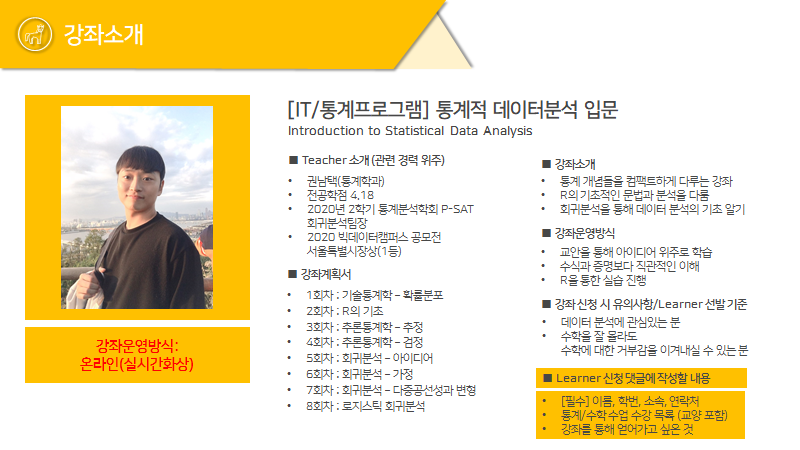

```{r setup, include=FALSE}
knitr::opts_chunk$set(echo = TRUE)
```

첫 회차 강의를 진행하기 전에, 저와 강의에 대한 소개를 먼저 진행하겠습니다.

# 1. 소개

```{r figure1, echo = FALSE, fig.align='center', out.width='90%'}

```

안녕하세요! 이번 성균공부방 **'통계적 데이터 분석 입문'** 강좌를 개설한 통계학과 15학번 권남택입니다. 강의를 진행하기에 앞서 저에 대해 간단히 소개하고자 합니다.

* 권남택 : 15학번
* 통계학과 4학년(복수전공 X)
  - 전공평점 4.18
    - 수학과목 : 통계수학, 행렬대수학, 통계학원론, 수리통계학입문, 통계적추론입문, 해석학1, 확률과정론입문
    - 분석이론 : 회귀분석입문, 실험계획법, 통계적데이터마이닝, 베이즈통계입문, 다변량통계분석입문, 금융통계학입문, 통계와데이터사이언스, 통계적모델링&머신러닝실습
    - R 프로그래밍 : 통계프로그래밍입문, 통계계산입문, 통계와데이터사이언스, 통계적모델링&머신러닝실습
    - Python 프로그래밍 : 머신러닝과 딥러닝
  - 자대 통계학과 학석연계 입학 에정
  - 관심 분야 : Bayesian Statistics & Causal Inference
* 통계학회 P-SAT
  - 2020년 1학기 시계열(Time Series) 팀원
  - 2020년 2학기 회귀분석(Regression Analysis) 팀장
  - 2021년 1학기 학회장
* 데이터분석 프로젝트
  - 서울시 공공와이파이 우선입지선정 (P-SAT 20-01 주제분석)
  - 카카오아레나 멜론 플레이리스트 추천 (P-SAT 20-02 주제분석)
* 공모전
  - 2020 빅데이터캠퍼스 공모전 서울특별시장상(1등)
    - 서울시 공공와이파이 우선입지선정 : Using Clustering Analysis & Location Allocation Algorithm
  - 다음 방학에 나갈 계획입니다....힘드네요
* Skills
  - R : 3년 사용
    - Tidyverse, caret 등 전처리/모델링 능숙
  - Python : 1년 사용
    - numpy, pandas, sklearn 사용 가능
* 동아리 경험
  - 사회과학대 노래패 아우성 (2015~2016)
  - 사회과학대 축구동아리 FC Upside (2015~2020)
    - 2020년 1학기 주장
    
TMI로 많이 적어보았습니다!

# 2. 강의 소개

## 2.1 강의 목표

- 통계개념을 컴팩트하게 다루는 강좌
  - 통계학원론+회귀분석입문을 4주 8회 만에 끝내기 때문에, 세세하게 설명하기 보다 아이디어 위주로 설명할 예정입니다.
  - 하지만 통계학원론 만으로는 추정/검정 부분에서 유의미한 아이디어를 가져오기 어려워서, 수리통계학적인 설명이 조금 추가될 예정입니다.
- R의 기초적인 문법과 분석을 다룸
  - R의 자료형에 대한 이해
  - R의 대표적인 전처리 패키지 dplyr 실습
  - R로 진행하는 데이터 분석 실습
- 회귀분석을 통한 데이터 분석의 기초 알기
  - 회귀분석의 개념과 가정 이해
  - 선형모형의 장점과 단점 이해
  - 이후 머신러닝 모델들을 다루기 위한 기본적인 아이디어 제공
- 수식을 최대한 배제하고 직관을 전달
  - 수식 자체보다는 수식이 지닌 의미를 전달하기 위해 노력할 예정
  - 하지만 필요한 경우 증명이 포함될 예정

저는 이제 다음학기 학부+대학원 수업을 듣는 화석입니다... 그러다보니 저에게 있어서 너무나도 이제는 당연한 것들이 여러분들에게는 생소할 수 있다고 생각해요. 수업 시간 중간중간에 질문을 받을테니, 그때 질문해주시면 더욱 더 쉽게 설명해드리려고 노력하겠습니다!

또한 이 강의를 열때는 깊게 생각하지 않았는데, 생각해보니 행렬에 대한 이해가 부족하신 분들이 있을 것 같아요. 회귀분석부터 행렬이 툭툭 튀어나올텐데, 최대한 수식자체보다는 수식이 가지는 의미를 설명하려고 노력하려 합니다. 그리고 그 의미는 생각보다 고등학교 수학수준으로 많이 도출할 수 있다고 생각해요. 고등학교때 미분해서 극대/극소, 최대/최소 많이 찾았었는데, 그런것들이 종종 나올겁니다.
  
## 2.2 강의일정 및 강의계획서 

- 1회차[온라인]-1/11 월요일 (10:00~12:00): 기술통계학 - 확률, 통계, 확률변수 등 기초개념
  - 기초적인 분포들을 학습
- 2회차[온라인]-1/13 수요일 (10:00~12:00): R의 기초 - 자료형 및 기본 함수 파악
  - R의 기초적일 활용을 학습
- 3회차[온라인]-1/18 월요일 (10:00~12:00): 추론통계학 - 점추정과 구간추정
  - 좋은 추정량의 기준과 왜 '평균'이 좋은지 학습
- 4회차[온라인]-1/20 수요일 (10:00~12:00): 추론통계학 - 평균과 분산에 대한 검정, 검정의 설계
  - 흔한 가설검정 예제와 가설검정의 설계 이해
- 5회차[온라인]-1/25 월요일 (10:00~12:00): 회귀분석 - 회귀분석의 목표와 단순/다중회귀분석
  - 회귀분석의 목표와 장점, 해석방법 학습
- 6회차[온라인]-1/27 수요일 (10:00~12:00): 회귀분석 - 회귀분석의 가정/위반/교정
  - 회귀분석의 가정 이해를 통한 일반화된 가정 학습
- 7회차[온라인]-2/01 월요일 (10:00~12:00): 회귀분석 - 다중공선성/변형된 회귀분석
  - 회귀분석의 해석과 성능 사이의 간극 메꾸기
- 8회차[온라인]-2/03 수요일 (10:00~12:00): 로지스틱 회귀분석 - 분류문제에 대한 회귀분석적 접근
  - 일반화 선형모형으로의 확장
  
앞에서는 확률통계 부분을 3회차 만에 핵심만 보고, 뒤에 5~8회차 동안 회귀분석의 핵심만 딱 볼겁니다. 각각 한 학기 내용을 압축하다보니, 내용적으로 점프가 있을 수 밖에 없고, 논리적으로 비약이 발생할 수 밖에 없어요. 하지만 최대한 그 안에서 핵심만 가져가면서, 어떤 아이디어로 흐름이 이어지는 지를 설명하려 합니다. 추가적으로 5~7회차에 대한 심화자료가 만들어져 있어서 올려드릴테니, 더 공부하고 싶으신분들은 읽어보시고 궁금한거 언제든 물어봐주세요!

# 3. 강의 방식

- 실시간 화상
- 만들어온 교안을 통해 학습
  - R markdown을 통해 latex로 만들기 때문에 다소 딱딱한 구성일 수 있습니다. latex에서 폰트 지정, 수식 입력, 사진 첨부 과정이 처음이기 때문에 중간에 귀찮으면 그냥 워드로 만들 수도 있지만, 아마 여러분들에게 둘의 차이는 크게 느껴지지 않을거에요.
- 교안은 매 수업 하루 전에 카톡방에 올릴 수 있도록 하겠습니다.

만약 수학에 익숙치 않으시다면, 4주 동안 꽤나 힘들 수도 있습니다. 그래서 '수학을 잘 몰라도, 수학에 대한 거부감을 이겨낼 수 있으신 분'이란 조건을 달았고요. 만약 너무 어려우시다면 힘들게 끝까지 따라오려고 하시지 않아도 됩니다. 그래도 최대한 쉽게 가려고 하니, 8회차까지 함께하시면 얻어가는 것이 있을거라고 자부합니다! 아침에 일어나야하는 만큼 화이팅해서 해봐요!


