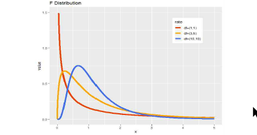

```{r setup, include=FALSE}
knitr::opts_chunk$set(echo = TRUE)
```


# 통계학이란?

## What, How, Why

### What

- 통계학은 관심 또는 연구대상이 되는 집단(**모집단**)의 특성을 파악하기 위해 모집단으로부터 일부의 자료(**표본**)을 수집, 정리, 요약, 분석하여 표본의 특성을 파악하고 이를 이용해 모집단의 특성에 대해 추론하는 원리와 방법을 배우는 학문.
  - 예시 : 다음 대선에서 대한민국 국민(모집단)은 어느 후보에 투표할까? 이를 합리적으로 추론하기 위해 모집단을 잘 대표하는 일부 표본을 추출해서 분석을 하고 예측한다.
  
### How 

기술통계학과 추론통계학

- 기술통계학 : 수집된 자료들의 특성을 쉽게 파악할 수 있는 형태로 표현하는 것. 있는 그대로 보기.
  - 평균, 중앙값, 최빈값, 분산, 표준편차, 왜도, 첨도, 사분위수, 등등등
  - 막대그래프, 파이그래프 등등 시각화
  - 통계량(statistic) + 시각적 표현(Visualization)
- 추론통계학 : 추출된 표본의 정보를 사용해 모집단의 특성을 파악
   - 현재 있는 표본을 통해 일반화된 결론을 도출하고 싶음.
   - 이를 위해 추정(Estimation)과 검정(Test)를 진행.
   - 수리통계학 후반부는 추정이론과 검정이론을 다룸(우리 3~4회차 내용!). 어떻게 추정해야 좋은 추정이고, 어떻게 검정해야 좋은 검정인지를 이론적으로 도출해냄. 살짝 맛보기 할 예정.

### Why

- 모든 데이터는 표본이다

우리가 접하는 모든 데이터는 표본이다. 빅데이터 시대에 어쩌면 우리는 모집단을 관측할 수 있는 상황이 되었다고 할 수 있지만, 현실의 많은 일은 비용과 시간의 문제로 표본을 추출하여 분석될 수 밖에 없다. 설령 모집단을 관측할 수 있다고 하더라도 모집단을 모집단으로 보아서는 좋은 결과가 나오기 어렵다.

예를 들어보자. 현재 성균관대학교에는 2015년부터 모든 입학생과 졸업생에 대한 기록과 정보가 남아있다. 학기별 학점, 수강과목, 교환학생 참여여부, 취업여부, 입학전형 등의 정보가 있을 수 있다. 이 데이터를 분석하고자 하는 목적은 무엇인가? 단순히 지금까지 학생들의 특성을 파악하는데에 멈추려는 것이 아니고, 분석된 결과를 바탕으로 이후에 어떤 학생을 선발하는 것이 학교에 좋을지에 대한 의사결정이 이루어진다. 그렇다면 우리는 '15학번 이후 성균관대학교 학생'이 모집단일 수 있지만, 동시에 '현재+미래의 성균관대학생'의 표본이 될 수 있는 것이다. 

따라서 우리는 통계학을 버리고서 예측문제를 다룰 수 없다. 기본적인 통계학적인 개념들이 잡혀있어야 예측과 예측결과에 대한 해석을 할 수 있다.

- 기초적인, 하지만 근본적인 모델링

알파고(AlphaGo) 이후에 머신러닝(기계학습)과 딥러닝에 대한 관심이 날로 높아지고 있다. 어떤 사람들은 통계학의 시대는 저물었고, 딥러닝이 우리 문제들을 해결해줄 것이라고 믿는다. 하지만 딥러닝이 압도적인 우세를 갖는 부분은 신호처리, 이미지, 텍스트, 게임에 대한 부분이고, 여전히 정형데이터 모델링에서는 통계학+머신러닝 방법이 가지는 장점이 우세하다. 통계학적인 모델링은 여러 장점들을 지니는데, 세가지 정도가 떠오른다.

  - 매우 가볍다
  - 해석이 간편하다
  - 수학적으로 명료하다.

그래서 우리는 데이터 분석에 가장 기초가 되는/하지만 다루려면 끝도 없는 회귀분석을 통해 데이터 분석에 입문하려 한다. 회귀분석을 공부하기 전에, 먼저 통계학기초부터 쌓아보자.

## 통계학의 가장 기본적인 개념

### 모집단 VS 표본

- 모집단(Population) : 연구대상이 되는 모든 관측값이나 측정값의 전체 집합  (ex) 대한민국 국민
- 표본(Sample) : 모집단 전체의 특성을 파악하기 위해 모집단으로부터 추출된 일부분 (ex) 여론조사에 참여한 국민

### 모수

- 모수(Parameter) : 모집단의 특성을 나타내는 미지의 수  (ex) 모평균($\mu$), 모표준편차($\sigma$)
  - 우리는 모집단을 조사할 수 없기 때문에 표본을 추출한다. 따라서 우리는 정확한 모수는 알 수 없고, 모수를 **'추정'**할 뿐이다.
- 통계량(Statistics) : 표본의 특징을 나타내는 변수  (ex) 표본평균($\hat{\mu} = \bar{x}$), 표본표준편차($\hat{\sigma}=s$)
  - 이렇듯 모수를 추정하는 통계량에는 모자를 씌우고, hat이라고 읽는다.
  
결론적으로 우리는 모집단의 특성을 나타내는 모수를 추정하기 위해서, 표본을 뽑아 표본의 통계량으로 모수를 파악한다.

## 자료형

### 양적자료 vs 질적자료

양적자료 : 측정단위를 이용한 측정값이 부여되고, 숫자의 크기가 의미를 갖는 자료
- 이산형 자료 : 0 또는 양의 정수를 가지며, 셀 수 있는(Countable) 자료
  - (ex) 권남택의 전애인 수, 하루 차량사고 횟수 
- 연속형 자료 : 일정 구간 안에 있는 숫자로 측정되며, 연속성을 띄고, 실수 위에 존재하는 값
  - (ex) 권남택의 키, 시간대별 강수량

질적자료(범주형 자료) : 숫자로 표현될 수 없는 자료를 집단화한 자료
- 명목형 자료 : 분류만 하여 값을 부여한 값. 순서가 없음
  - (ex) 성별, 혈액형, 치킨집 이름
- 순서형 자료 : 값에 순서가 있는 자료
  - (ex) 학력(대학원졸/대졸/고졸/중졸이하), 학점(A/B/C/D/F)
  
### 자료의 표현

위치의 측도 : 관측된 데이터가 어느 위치에 **'집중'**되어 있는가?
- 평균, 중앙값, 최빈값
  - Robust(강건)하다는 것은 '이상치에 영향을 덜 받는다'는 것을 의미한다. 보통 중앙값이 평균보다 이상치에 강건하다고 알려져 있다. 그런데 왜 우리는 평균을 일반적으로 사용할까?
  
산포의 측도 : 자료들이 얼마나 **'퍼져'**있는가?
- 분산, 표준편차, 왜도, 첨도

```{r multiple, echo = FALSE, fig.cap = '왜도와 첨도', fig.subcap=c('왜도skewness', '첨도kurtosis'), out.width='40%', fig.ncol=2, fig.align='center'}


```

# 확률(Probability)

## 왜 확률을?

불확실성의 정도를 계량한 것을 확률이라고 한다. 우리가 다루는 통계학은 기본적으로 표본의 관점에서 문제를 바라본다. 모든 관측치를 얻을 수 없음에 따라 표본이라는 무작위성을 갖게 된다. 따라서 좋은 추정/분석을 위해서 확률에 대해 먼저 정의하고 넘어가는 것이 필요하다.

### 표본공간

주사위를 던지는 (무작위) 실험을 했다. 이때 주사위 눈이 가질 수 있는 경우의 수는 1부터 6까지의 수이다. 이때 우리는 발생가능한 경우를 사건(사상, Event)라고 하고, 이 사건들의 집합을 표본공간(Sample space)라고 한다. 이 경우의 표본 공간은 $\{1,2,3,4,5,6\}$이 될 것이다.

## 확률의 개념

### 고전적 개념

실험의 결과에 나타날 수 있는 사상들의 발생 가능성이 동일하고, 사상들이 동시에 발생할 수 없는 경우.
$$P(A)=\frac{N(A)}{N(S)}$$
하지만 이 세상의 모든 일이 발생할 가능성이 동일하진 않기 때문에, 다음의 개념을 가져온다.

### 상대도수적 개념

실험을 무한히 반복할 경우 얻어지는 그 사상의 상대도수의 극한값
$$P(A)=\lim_{N\to\infty} \frac{n}{N},\quad \quad N:총 시행횟수, \quad n:사건 A의 발생횟수$$
하지만 N이 얼마나 커야하며, 과연 $P(A)$가 유일할지 알 수 없다. 

### 주관적 확률

어떤 사건에 대해 본인의 지식/관념/경험/정보를 활용해 가능성을 부여

- 당연히 사람에 의존하므로 객관적이지 않지만, 베이지안통계에서는 이를 잘 활용해 더 좋은 분석을 할 수 있다.

## 확률의 공리

이런 기존의 확률 개념의 모호함을 탈피하기 위해 우리는 확률의 공리를 제안한다. 공리란 증명없이 약속으로서 사용하는 수학체계다.

임의의 사건 A에 대하여,

1. $0\leq P(A) \leq 1$
1. $P(S)=1$
1. 서로 배반인 사건의 나열인 $A_i, i=1,2,3,...$에 대해, $P(A_1 \cup A_2 \cup \cdots)=\sum_{i=1}^{\infty} P(A_i)$

## 배반사건과 독립사건

배반(Exclusive) : 동시에 발생할 수 없다 $\rightarrow$ 사건 A와 B가 배반이다. $rightarrow$ 교집합이 공집합이다.

상호배반(Mutually exclusive) : 어떤 임의의 두 개의 사건도 공통원소를 가지지 않는 경우

독립(Independent) : 사건 A의 발생이 사건 B의 발생에 영향을 주지 않는 경우
$$P(A_i \cap A_j)=P(A_i)P(A_j)$$

상호독립(Mutually Independent) : 표본공간내의 모든 사건에 대해 모든 조합을 고려했을 때, 독립조건이 만족하는 경우
$$P(A_1 \cap A_2 \cap \cdots \cap A_n)=P(A_1)P(A_2)\cdots P(A_n)$$

## 조건부확률과 베이즈정리

조건부확률 : 주어진 사건이 일어났다는 가정 하에, 다른 사건이 일어날 확률. 표본공간을 주어진 사건으로 한정시켜 구한다.
$$P(A|B)=\frac{P(A \cap B)}{P(B)}$$

- (ex) 축구 리그에서 A팀이 전 경기를 이겼을 때(B), 이번 경기를 이길 확률(A)


베이즈 정리 : 두 확률변수의 사전확률과 사후확률의 관계를 나타내는 정리
$$P(A|B)=\frac{P(B|A)P(A)}{P(B)}$$

- (ex) 실제 폐암에 걸린 것/안걸린 것(A)과 검사에서 양성/음성(B)인 경우를 생각하자. 결과가 음성인데, 실제로 폐암에 걸린 경우 $P(A|B)$가 얼마나 되는지 우리는 알고 싶다. 이 경우 발생하는 비용이 상당하기 때문!! 이를 알기 위해서 실제 폐암에 걸렸는데 음성인 경우$P(B|A)$와 폐암에 걸리는 경우 $P(A)$, 검사가 음성인 경우 $P(B)$를 알 수 있다면, 해당 확률을 추적해 구할 수 있다.
- 베이즈 정리는 베이지안 통계에 근간이 되는 정리로 베이지안 통계에 매우 중요하지만, 우리가 학습할 통계는 베이지안 통계가 아니므로 여기까지만 맛보기로 한다.

# 확률변수

## 확률변수의 필요성

사건은 말이나 문자로서 표현된다. 예를 들어 동전 던지기를 생각하면 전체 표본공간 $S=\{앞면, 뒷면\}$이다. 이렇듯 개별적으로 이해되기 때문에, 저 상태에서는 일반화될 수 없다. 따라서 우리는 $앞면 = 1, 뒷면 = 0$으로 대응시켜 표현하려 한다.

## 확률변수 (Random Variable)

표본공간 내에 있는 각 원소를 하나의 실수값에 대응시키는 함수. 확률변수를 통해 말이나 문자를 숫자로 대응시킨다.

```{r figure2, echo = FALSE, fig.cap = '확률변수의 시각적 이해', fig.align='center', out.width='50%'}

```

### 확률변수(Random Variable)의 종류

이산형 확률변수 : 확률변수 X가 가질 수 있는 값이 유한 or 무한 개로 셀 수 있는 경우. 
- (ex) 이번 공연때 내가 부른 곡 수

연속형 확률변수 : 확률변수 X가 가질 수 있는 값이 일정 구간 안에 있는 실수로, 무한개이고 셀 수 없는 경우.
- (ex) 통계적 데이터분석 강좌를 듣는 사람들의 키

통계에서 대문자 $X$는 확률변수를 의미하고, 소문자 $x$는 실제로 우리가 관측한 값을 의미한다. 뒤에 5회차부터 나오는 대문자는 확률변수 혹은 행렬(Matrix)를 의미하고, 소문자는 관측값 혹은 벡터(vector)를 의미한다.

## 확률분포 (Probability Distribution)

확률분포는 확률변수가 가질 수 있는 모든 값과 각 값에 대응하는 확률을 나타낸 식 혹은 표.

- 이산형 확률분포 : 이산형 확률변수가 가질 수 있는 값과 그에 대한 확률을 표현
  - 확률질량함수(pmf) : 이산형 확률분포의 함수적 형태
  - 종류 : 베르누이 분포, 이항분포, 다항분포, 초기하분포, 기하분포, 음이항분포, 포아송분포, $\cdots$
- 연속형 확률분포 : 연속형 확률변수가 가질 수 있는 값과 그에 대한 확률을 표현
  - 확률밀도함수(pdf) : 연속형 확률변수의 함수적 형태
  - 종류 : 정규분포, 표준정규분포, 지수분포, 감마분포, 카이제곱분포, T분포, F분포, $\cdots$

해당 분포들은 개별적으로 존재하지 않고, 서로 유기적으로 연결되어 있다. 앞서 언급한 분포를 모두 볼 수 있다면 좋겠지만, 시간상 앞으로 나올 분포만 다루도록 한다.

## 이산형 확률분포

### 베르누이 분포 (Bernoulli Distribution)

1. 표기 : $X \sim Ber(1,p)$
1. 시행 : 한 번의 시행이 성공$(1)$ 혹은 실패$(0)$ 두 가지 결과만이 존재하는 경우. 
1. 확률변수가 가지는 값 : 1(성공), 0(실패)
1. 모수 : $p$ (성공확률)
1. 확률밀도함수 : $p(x;p)=p^x (1-p)^{1-x}, \quad x=0,1, \quad 0\leq p \leq 1$
1. 기대값과 분산 : $E(X)=p, \quad Var(X)=p(1-p)$
1. 예시 : 남택은 일주일에 4번정도 콜라를 먹는다고 한다. 그러면 오늘 남택이가 콜라를 먹는 경우를 확률분포로써 표현하게 되면 베르누이 분포를 통해 표현할 수 있다. $Ber(\frac{4}{7})$

### 이항분포 (Binomial Distribution)

1. 표기 : $X \sim ~b(n,p)$
1. 시행 : 성공확률이 $p$인 베르누이 시행을 '독립적'으로 n번 반복하는 것이다. n번의 '독립적인' 시행에서, 매 시행마다 성공확률이 '동일하게' $p$일 때 '성공한 횟수'가 궁금하다.
1. 확률변수가 가지는 값 : $\{0,1,2, \cdots ,n\}$, n번의 시행동안 전부 실패하는 것부터 전부 성공하는 경우까지 고려.
1. 모수 : $n$(시행횟수), $p$(성공확률)
1. 확률분포 : $p(x;n,p)=\binom{n}{x} p^x (1-p)^{n-x}, \quad x=0,1,2, \cdots,n, \quad 0 \leq p \leq 1$
1. 기대값과 분산 : $E(X)=np, \quad Var(X)=np(1-p)$
$$
\vspace{10\baselineskip}
$$
1. 예시 : 남택은 일주일에 4번정도 콜라를 먹는다고 한다. 그러면 남택이가 앞으로 4일동안 콜라를 몇 번 먹을까?  $b(4, \frac{4}{7})$

```{r figure3, echo = FALSE, fig.cap = '이항분포 시각화', fig.align='center', out.width='70%'}

```

### 다항분포 (Multinomial Distribution)

1. 표기 : $\textbf{X} \sim multinom(n, \textbf{p}), \quad where \quad \textbf{X}=(X_1, \cdots, X_k)^T, \textbf{p}=(p_1, \cdots,p_k)^T$
1. 시행 : 베르누이 시행의 확장. 베르누이 시행은 성공 혹은 실패의 두 가지 경우만 있었지만, 다항분포에서는 각 시행에서 가능한 결과가 3개 이상이 되는 시행이다. 한번의 시행에서 $\textbf{p}=(p_1, \cdots,p_k)^T$의 확률로 k 가지의 결과 $(E_1, \cdots, E_k)$ 중 어느 하나가 발생한다. 이를 독립적으로 $n$번 반복하여 실행한다고 할 때, 각각의 결과인 $(E_1, \cdots, E_k)$의 발생횟수가 궁금하다.
1. 확률변수 : $n$번의 시행 중에서 각각의 결과 $(E_1, \cdots, E_k)$가 발생한 횟수
1. 모수 : $n$ (시행횟수), $\textbf{p}=(p_1, \cdots,p_k)^T$ (성공확률)
1. 확률분포 : $p(x_1, \cdots,x_n;n,p_1,\cdots,p_k)=\binom{n}{x_1,\cdots,x_k}p_1^{x_1} \cdots p_k^{x_k}, \quad \sum_{i=1}^{k}x_i=n, \sum_{i=1}^{k}p_i=1$
1. 예시 : 남택은 매일 한가지의 다양한 콜라를 먹는다. 코카콜라/펩시/815콜라를 모두 먹는데, 각각 먹을 확률은 $(0.3, 0.6, 0.1)$이다. 그러면 앞으로 4일 동안 각각의 콜라를 얼마나 먹을까? 남택이가 4일 동안 각 콜라를 먹는 횟수는 $multinom(4, 0.3, 0.6, 0.1)$를 따른다.

### 포아송분포(Poisson Distribution)

1. 표기 : $X \sim pois(\lambda)$
1. 시행 : 정해진 시간/공간 내에서 발생한 사건의 횟수가 궁금
1. 확률변수 : 단위시간/단위공간에서 발생하는 사건 수
1. 모수 : $\lambda$ (단위시간/단위공간에서 발생한느 사건의 평균)
1. 확률분포 : $P(x;\lambda)=\frac{\lambda^x e^{-\lambda}}{x!}, \quad x=0,1,2,\cdots$
1. 기대값과 분산 : $E(X)=\lambda, \quad Var(X)=\lambda$
1. 예시 : 1시간 동안 올레사거리 따릉이 정거장의 따릉이 대여 횟수

```{r figure4, echo = FALSE, fig.cap = '포아송분포 시각화', fig.align='center', out.width='70%'}
knitr::include_graphics('pois.png')
```

### 이항분포와 포아송분포

이항분포의 시행 $n$이 매우 크고, 성공확률 $p$가 매우 작을 경우 포아송 분포로 근사할 수 있다. 
$$b(n,p) \approx pois(np=\lambda)$$

이항분포의 확률을 계산할 때, 시행횟수가 많아서 계산이 복잡할 경우 포아송 분포로 근사할 수 있게 된다. 이 아이디어에서 핵심은, 분포들 사이에는 연관이 있다는 것!!!

## 연속형 확률분포

### 정규분포

1. 표기 : $X \sim N(\mu, \sigma^2)$
1. 중요성 : 통계학에서 가장 중요한 분포.
  - 사회적/자연적 현상에서 볼 수 있는 다양한 자료의 분포가 정규분포와 유사하다.
  - 3,4회차에서 다룰 중심극한정리, 추정과 검정에서 핵심이다.
1. 확률변수 : 정규분포를 따르는 X
1. 모수 : $\mu$ (평균), $\sigma^2$ (분산)
1. 확률분포 : $f(x;\mu,\sigma^2)= \frac{1}{\sqrt{2\pi \sigma^2}} e^{-\frac{(x-\mu)^2}{2\sigma^2}}, \quad -\infty <x<\infty$
1. 중심극한정리 : 표본평균의 분포는 $n$이 커짐에 따라 정규분포에 근사한다. (3회차에서 다시 보자)

### 표준정규분포

1. 표기 : $Z \sim N(0,1)$
1. 필요성 : 정규분포는 상수(스칼라값)를 더하거나 곱해도 정규분포를 따른다. 
$$aX+b \sim N(a\mu+b, a^2\sigma^2)$$
그에 따라 각각 다른 모수를 가진 정규분포들을 비교할 수 있게 된다. 또한 이후 나올 분포들에서 표준정규분포를 이용하기 때문에 중요하다.
1. 확률변수 : 표준정규분포를 따르는 $X$
1. 모수 : $0$ (평균), $1$ (분산)
1. 확률분포 : $f(x)=\frac{1}{\sqrt{2\pi}}e^{-\frac{1}{2}x^2}$

```{r figure5, echo = FALSE, fig.cap = '정규분포 시각화', fig.align='center', out.width='70%'}

```

### 카이제곱분포 (Chi-Square Distribution)

1. 표기 : $X \sim \chi_k^2$, 자유도$(k)$
  - 자유도 : 실제로 독립적인 값의 갯수...말이 어려운데 이는 3회차 추정에서 다시 보자!

2. 용도 : 분산에 대한 검정 등 여러 검정에 사용

3. 유도 : 표준정규분포를 따르는 확률변수를 제곱해서 더하면 카이제곱분포가 되고, 자유도는 더한 개수 $k$를 따른다.
$$
X_1, \cdots, X_k \overset{\text{iid}}{\sim} N(0,1) \\
\sum_{i=1}^{k}X_i^2 \sim \chi_k^2
$$

3. 모수 : $k$ (자유도)

4. 확률분포 : $f(x;k)=\frac{1}{2^{\frac{k}{2}}\Gamma(\frac{k}{2})}x^{\frac{k}{2}-1}e^{-\frac{x}{2}}$

```{r figure6, echo = FALSE, fig.cap = '카이제곱분포 시각화', fig.align='center', out.width='70%'}

```

### t분포 (t-Distribution)

1. 표기 : $X \sim t_{(k)}$
2. 용도 : 평균에 대한 검정으로 많이 사용됨. 또한 회귀분석에서도 개별 회귀계수에 대한 검정에 사용.
3. 유도 : 표준정규분포를 카이제곱분포에 루트를 씌우고 자유도를 나누고 나눠주면 t분포가 된다. 말이 복잡하니 수식으로 보자.
$$
Z \sim N(0,1), \quad X \sim \chi_k^2 \\
\frac{Z}{\sqrt{X/k}} \sim t_{(k)}
$$

4. 모수 : $k$ (자유도)
5. 특징 : 자유도가 커질수록 정규분포에 근사한다. t분포 자체는 표준정규분포보다 꼬리가 더 두꺼운 형태.

```{r figure7, echo = FALSE, fig.cap = 't분포 시각화', fig.align='center', out.width='70%'}

```

### F분포 (F-Distribution)

1. 표기 : $X \sim F_{(m,n)}$
2. 용도 : 분산 비에 대한 검정, 회귀분석에서 회귀식에 대한 검정
3. 유도 : 각각 자유도가 $m, n$인 카이제곱분포를 따르는 독립인 두 확률변수의 비로서 만들어진다. 수식으로 파악하자.
$$
\frac{\chi_m^2 / m}{\chi_n^2 / n} \sim F_{(m,n)}
$$

4. 모수 : $m,n$ (각 카이제곱분포의 자유도)

```{r figure8, echo = FALSE, fig.cap = 'F분포 시각화', fig.align='center', out.width='70%'}

```

# All models are wrong, but some are useful.

이번 첫 회차는 다루는 내용들이 매우 기초적인 내용이다보니, 배운 내용을 하나로 관통하는 주제같은 것이 없습니다. 그러다보니 뭔가 개념들은 많았는데, 와닿는게 다소 없었을 거라고 생각이 들어요. 확률변수들은 뭐고, 여러 분포들은 왜 배우는지 모르겠고 애매할텐데, 가장 많이 쓰이는 분포들만 뽑아왔으니, 이제 이후에 어떻게 사용되는지 알게될 거에요.

이런 확률분포를 정의함에 따라 우리는 상황을 보다 간편하게 모델링 할 수 있게 됩니다. 우리가 예측하고자하는 값이 -무한대에서 무한대 값을 가지면 정규분포를 이용하게 되고, 이게 회귀분석입니다. 우리가 예측하고자 하는 값이 성공/실패, 사망/생존, 양성/음성과 같이 이항변수이면 이항분포를 이용하게 되고, 이게 8회차에 다룰 로지스틱 회귀분석입니다. 심지어 포아송분포는 어떤 현상의 횟수를 예측할때 사용될 수 있습니다. 실제 현실의 값이 분포에 100% 일치하지는 않겠지만, 현실에 대한 좋은 근사를 할 수 있을 것입니다. 

그래서 이런 분포를 이용하는 이유는 매우 **유용**하기 때문입니다. 이런 기초적인 분포를 이용해서 우리는 현실에 근사하는 좋은 예측을 할 수 있게 됩니다. 우리의 모델은 언제나 틀렸지만, 유용할 수 있습니다. George Box의 말, '모든 모델은 참이 아니지만, 그중에 유용한 것이 있을 뿐이다.' 대로 유용한 모델을 만들기 위해 8회차까지 공부해봅시다!

# 참고자료

1. 김동욱. (2015). 통계학원론
1. Hogg, McKean, Craig. (2013). Introduction to Mathematical Statistics
1. P-Sat 19-02 통계학원론팀 교안