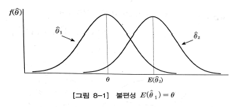
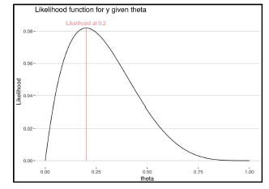

```{r setup, include=FALSE}
knitr::opts_chunk$set(echo = TRUE)
```

# 표본

## 표본의 필요성

  1회차 때 여러 통계적인 분포들에 대해 다루었다. 1회차 때 나왔던 질문처럼, 1회차에서 다루는 기술통계학에서는 표본에 대한 관심이 아직 없었다. 정규분포는 어떻게 생겼고, 포아송 분포는 어떠하고 논한 것들은 모두 모집단 차원에서 논했다고 보아도 문제가 없다. 왜냐하면 현실의 데이터는 당연히 해당 분포와 100% 일치하지 않고, 일치할 수 없기 때문이다. 그래서 해당 분포가 가지는 성질들(기댓값, 분산, 다루지는 않았지만 적률과 적률생성함수)과 모수들에 대해 공부하게 된다. 이런 특징들을 잘 알고 있어야, 이후에 표본차원에서 해당 분포들을 다룰 때 도움이 되기 때문이다.

  그래서 앞으로 다룰 내용은 모두 표본의 관점에서 문제를 바라본다. 우리가 모집단 전부에 대해서 알 수 없기 때문에, 주어진 표본을 통해 모집단의 특성에 대해 짐작할 뿐이다. 그래서 통계학의 목적은 결국에는 '모집단의 특성을 나타내는 모수를 추론'하는 것이다. 이제부터 다룰 '추정'과 '검정'이 그 핵심이고, 이는 통계적 데이터 분석의 기본으로 깔려있다. 머신러닝에 대한 공부를 깊게 할수록, 통계학과 머신러닝의 연관성을 찾아보기 가장 좋은 부분중에 하나가 추정에서 '최대가능도추정'이기도 하다. 이런 서론들을 이제 뒤로하고, 이제 시작하자.

<div align=center>
<i> 통계적 추론 : 모집단의 특성을 나타내는 모수에 관한 추정(Estimation) + 가설검정(Hypothesis Testing) </i>
</div>
<div align=center>

우리가 표본을 추출할 때마다 표본은 달라질 것이다. 무작위 추출이기 때문에,,,. 결국 표본은 랜덤성을 가지고 있기 때문에 표본으로 만든 표본통계량(ex : 표본평균, 표본분산)도 랜덤성을 가진다. 따라서 표본 통계량 자체도 확률변수가 된다. 확률변수는 확률분포를 가지기 때문에 표본통계량도 분포를 가지고, 이를 '표본분포'라고 한다.

## 표본 용어 정리

- 확률표본(Random Sample) : 확률적으로 추출된 관측값으로, 이 표본들은 독립적(Independent)이고 동일한 확률분포로 부터 나온다(Identically distributed). 즉, $X_1, X_2, \cdots, X_n$이 상호독립적으로 동일한 분포를 따를 때, 이를 크기 $n$인 확률표본(Random Sample)이라고 한다. Random Sample은 iid(Independent & Identically distributed)와 같은 뜻이다.
- 표본통계량(statistics) : 표본의 특징을 나타내는 함수. 모수를 포함하고 있으면 안된다.
  - (ex) 표본평균을 계산하는데, 모평균$(\mu)$를 사용해선 안됨. 모평균의 대체값으로서 표본평균을 사용할텐데, 모평균이 들어가면 말이 안되는 것
  - 표본평균$(\bar{x})$ : 모집단으로부터 무작위 추출로 뽑힌 n개의 표본의 평균 $\bar{X} = \frac{1}{n}(X_1+X_2+ \cdots+ X_n)$
  - 표본평균$\bar{X}$ : 확률변수로, $\bar{X} = \frac{1}{n}(X_1+X_2+ \cdots+ X_n)$
  - 표본분산$S^2$ : 표본의 분산 $S^2=\frac{1}{n-1}\sum_{i=1}^{n}{(X_i-\bar{X})^2}$
- 표본분포(Sample distribution) : 표본으로 계산된 표본통계량의 확률분포
- 추정(Estimation) : 통계량을 이용해 모수를 추론하는 것. 점추정과 구간추정
- 추정량(Estimator) : 모수를 추정하는데에 사용되는 통계량
  - (ex) 모평균$(\mu)$를 추정하기 위해 사용하는 표본평균$(\bar{x})$
- 추정값 : 추정량이 관측된 샘플로서 계산된 값. 
  - (ex) 1, 3, 5라는 표본이 얻어졌다면 표본평균의 추정값은 3
- 표준오차(Standard Error, s.e) : 추정량의 표준편차
  - 표준편차와의 차이 : 표준편차는 그냥 우리 데이터가 얼마나 퍼져있는지를 표현한 것. 표준오차는 표본통계량의 관점에서 보는 것.

## 대수의 법칙 (Law of Large Number)

표본크기 $n$의 확률표본 $X_1, X_2, \cdots, X_n$이 평균 $\mu$, 분산 $\sigma^2 < \infty$인 분포로부터 추출되었을 때, 임의의 $\epsilon>0$에 대해 다음이 성립한다.
$$
\lim_{n \rightarrow \infty} P(|\bar{X}-\mu|<\epsilon)=1
$$
쉽게 말하자면, $n$이 커질수록 $\bar{X}$와 $\mu$는 거의 같다는 것! 100%같다는 것이 아님! 이는 엄밀하게 '대수의 약법칙'이라고 하고, '대수의 강법칙'도 존재하나 이는 더 어려운 개념이므로 생략한다.

간단하게 R을 통해 볼까?

```{r}
x = rnorm(100, mean = 10, sd = 10); mean(x)
x = rnorm(1000, mean = 10, sd = 10); mean(x)
x = rnorm(10000, mean = 10, sd = 10); mean(x)
x = rnorm(100000, mean = 10, sd = 10); mean(x)

y = rbinom(100, size = 200, prob = 1/20); mean(y)
y = rbinom(1000, size = 200, prob = 1/20); mean(y)
y = rbinom(10000, size = 200, prob = 1/20); mean(y)
y = rbinom(100000, size = 200, prob = 1/20); mean(y)
```

점점 표본평균과 모평균의 차이가 작아지는 것을 관측할 수 있다.

## 중심극한정리 (CLT)

  우리는 대수의 법칙을 통해 표본평균이 모평균에 확률 수렴한다는 것을 배웠다. 그런데 이 확률분포에 대한 논의는 하지 않았다. 만약 모집단이 $N(\mu, \sigma^2)$를 따른다면, 각각의 확률표본 $X_1, \cdots, X_n \sim N(\mu, \sigma^2)$라는 것은 자명하다. 더불어서 대수의 법칙으로 인해 $E(\bar{X})=\mu$가 되고, 표본평균은 각 표본의 선형결합이므로, $Var(\bar{X})=\frac{\sigma^2}{n}$이 된다. 이해안되면 간단히 증명할 수 있다. 그 결과 $\bar{X} \sim N(\mu, \sigma^2)$가 된다.

  하지만 모집단이 어떤 분포를 따르는지 모를 경우 해당 논의는 무의미해진다. 그러나 '중심극한정리(Central Limit Theorem)'는 이를 매우 훌륭하게 해결한다. 이를 증명하는 것은 테일러 전개에 대한 해석학 수준의 이해가 필요하기 때문에 그냥 받아들이는 것이 좋다. latex 편리를 위해 잠시 영어르 쓰면,
$$
\begin{aligned}
Let \; X_1, \cdots, X_n \overset{\text{iid}}{\sim} (\mu, \sigma^2), \quad &E(X_i)=\mu, \quad var(X_i)=\sigma^2<\infty  \\
then \quad \bar{X} &\approx N(\mu, \frac{\sigma^2}{n})
\end{aligned}
$$
즉, 모집단의 분포와 상관없이, 유한한 분산하에서 표본크기 $n$이 충분히 크다면 표본평균의 분포는 정규분포에 근사한다. 따라서 모집단의 분포가 정규분포가 아니거나, 아에 분포를 모를 때도, 표본크기만 적당히 크다면 CLT를 이용해 정규분포를 사용할 수 있다.

그러면 이를 R을 통해 직접 확인해보자. $X \sim b(30, \frac{1}{6})$라고 하면, 5를 중심으로 분포할 것을 예측할 수 있다.

```{r}
clt_store <- rep(NA, 10000)
sample_size <- 100  # n = 100
for (k in seq_along(clt_store)){
  x <- rbinom(sample_size, 30, 1/6)
  clt_store[k] <- mean(x) # x bar
  if (k %% 2000 == 0) cat(k, "\n")
}
hist(clt_store)
```

또 다른 예시로 F분포를 가져와보자. $X \sim F(100, 30)$ 라고 했을때, 정확히 F분포의 기댓값이나 분산을 몰라도 상관없다. 추출된 표본평균들의 분포를 확인하자.

```{r}
clt_store <- rep(NA, 10000)
sample_size <- 100  # n = 100
for (k in seq_along(clt_store)){
  x <- rf(sample_size, 100, 30)
  clt_store[k] <- mean(x) # x bar
  if (k %% 2000 == 0) cat(k, "\n")
}
hist(clt_store)
```

# 점추정(Point Estimation)

점추정이란 모르는 모수의 참값을 추정하기 위해 '딱 하나의 값'을 집는 것이다. 추정에는 점추정과 구간추정(Interval Estimation)이 있는데, 구간추정은 특정 유의수준에서 모수가 존재하는 구간을 한정하는 것이다. 주로 점추정에 집중해서 보자.

## 추정량의 개념

우리는 모집단의 특성이 존재하고, 모집단의 특성을 나타내는 것을 모수(parameter)라고 한다. 그러나 우리는 정확한 모수를 알 수 없고, 그래서 우리는 표본의 특성인 통계량(statistic)를 사용한다. 이 통계량은 확률변수이기 때문에, 랜덤성을 가지고 모수에 대한 추정을 한다. 이 모수를 추정하기 위해 사용되는 통계량이 '추정량(estimator)'이고, 이 추정량이 관측되어 얻어진 값이 '추정값'이라고 한다.

예를 들어 성대 학생들이 통학하는 평균 거리가 궁금하다고 하자. 그래서 일부 표본을 뽑아서, 그들의 평균 통학거리를 계산했다. 그랬더니 평균 15km를 통학한다고 하자. 그러면 여기서 모집단, 모수, 표본, 통계량, 추정량, 추정값을 정의해보면,

- 모집단,모수 : 성대 학생들, (모)평균 거리
- 표본, 통계량 : 뽑힌 학생들, (표본)평균 거리
- 추정량, 추정값 : 표본평균, 15km

## 좋은 추정량(estimator)의 기준

세상에는 여러 추정량이 있다. 그리고 우리는 중고등학교 때 '평균의 역설'같은 내용을 많이 들으면서, 평균이 왜곡되는 상황들을 많이 보았다. 그래서 중앙값이 좋지 않나 생각하면서도, 평균을 많이 쓰는 것을 확인할 수 있다. 이는 두 가지 이유를 들 수 있겠는데, 

1) 중앙값은 계산하는 비용이 많이 든다 : 일일이 순서를 나열하고, 거기서 가운데에 있는 값을 골라야 한다. 만약 갯수가 짝수라면 딱 정해지지도 않는다.
1) 통계학적인 관점 : 평균이 좋은 추정량의 기준을 만족하는 경우가 많다.(표본평균의 분산이 표본중앙값의 분산보다 크다...!), 더불어서 CLT를 통해 정규분포로 다루는 것이 가능하다.

하지만 이는 단순 값으로 확인하는 것은 무리가 있다. 예를 들어 우리의 데이터가 ${1,3,4,6,7}$라고 하자. 이때 표본평균은 4.2이고, 중앙값은 4이다. 이 둘을 보고 과연 어떤게 더 좋다고 말할 수 있을까? 단연코 없다. 왜냐하면 샘플을 뽑으면 값은 달라질 수 있으니까! 그렇다면 우리에게 중요한 것은 실제 계산된 '추정값'이 아니라, 각각을 도출하는 방법이다. 

그래서 좋은 추정량을 판단하는 기준을 정하자. 이 기준들은 매우 직관적이므로, 이름을 듣거나 살짝의 수식을 보면 동의할 수 있다.

1) 불편성(Unbiasedness)
1) 효율성(Efficiency) $\approx$ 최소분산
1) 일치성(Consistency)

### 불편성 (Unbiasedness)

추정량 $\hat{\theta}$의 표본분포는 모수 $\theta$를 중심으로 분포해야 한다.
$$
E(\hat{\theta})=\theta
$$
$\hat{\theta}$은 표본이 바뀔때마다 값이 바뀐다, 확률변수니까! 즉, $\hat{\theta}$는 표본분포를 가지고, $\hat{\theta}$의 기댓값이 $\theta$라면 $\hat{\theta}$는 $\theta$를 중심으로 분포한다는 것이다. 우리의 추정량의 기대값이 모수가 되기를 바란다. 이를 불편성이라고 하고, 불편성을 만족하는 추정량을 불편추정량(Unbiased Estimator)라고 한다.

예를 들어, $\bar{X}$는 $\mu$에 대한 불편추정량이고, $S^2=\frac{1}{n-1}\sum_{i=1}^{n} (X_i-\bar{X})^2$는 $\sigma^2$에 대한 불편추정량이다. 간단히 증명해보자. (표본중앙값도 불편추정량이지만, 증명은 생략한다)
$$
\vspace{7\baselineskip}
$$

$\hat{\theta}$의 기대값이 $\theta$가 아닐 경우, $\hat{\theta}$는 편의추정량(Biased Estimator)이다. 이 $\hat{\theta}$의 편의(bias)는 
$$
bias(\hat{\theta}) = E(\hat{\theta})-\theta
$$
로 계산한다. 추정량의 기대값이 모수 $\theta$로부터 얼마나 떨어져 있는지 확인가능하다.

```{r figure1, echo = FALSE, fig.cap = 'Bias of Estimator', fig.align='center', out.width='60%'}

```

### 효율성 (Efficiency)

추정량의 분포인 표본분포의 변동이 가능한 작아야 한다. 즉 분산이 작으면 작을수록 좋다!

우리에게 주어진 추정량이 $\hat{\theta}_1, \hat{\theta}_2$두 가지라고 해보자. 이 두 추정량은 불편추정량이라고 했을때, 어떤 추정량이 좋은지 비교할 기준이 필요하다. 실제로 불편추정량은 정말 많다! 이때 필요한 기준이 효율성, 분산의 대소다. 분산이 작으면 작을수록 추정량의 분포가 추정량의 기대값을 중심으로 밀집할 것이다. 이는 표본추출에 따른 랜덤성으로 특이한 값이 뽑힐 가능성이 작아질 수 있음을 의미한다.


1) Case1 : $\hat{\theta}_1$과 $\hat{\theta}_2$ 모두 불편추정량인 경우는 불산만 비교하자.

$$
\begin{aligned}
Var(\hat{\theta}_1) < Var(\hat{\theta}_2), \quad &then \:\: \hat{\theta}_1 \:\:is \: better \: than \:\: \hat{\theta}_2 \\
RE(\hat{\theta}_1, \hat{\theta}_2)&=\frac{Var(\hat{\theta}_1)}{Var(\hat{\theta}_2)}
\end{aligned}
$$

$RE(\hat{\theta}_1, \hat{\theta}_2) > 1$이면 $\hat{\theta}_1$가 분산이 더 작으므로 효율적인 추정량이라고 할 수 있다.

그러면 표본평균과 표본중앙값을 시뮬레이션을 통해 비교해보자. 두 추정량은 각각 불편추정량이기 때문에, 추정량의 분산만 보면 되고, 이를 시뮬레이션을 통해 구해보자.

```{r}
mean_store <- rep(NA, 1000)
sample_size <- 100  # n = 100
for (k in seq_along(mean_store)){
  x <- rbinom(sample_size, 100, 1/5)
  mean_store[k] <- mean(x) # x bar
}

median_store <- rep(NA, 1000)
sample_size <- 100  # n = 100
for (k in seq_along(median_store)){
  x <- rbinom(sample_size, 100, 1/5)
  median_store[k] <- median(x) # x bar
}

var(mean_store)
var(median_store)
```

표본평균의 분산이 더 작은 것을 확인할 수 있다. 이를 히스토그램을 통해 다시 한 번 확인해보면,

```{r}
par(mfrow = c(1,2))
hist(mean_store)
hist(median_store)
par(mfrow = c(1,1))
```

2) Case2 : $\hat{\theta}_1$과 $\hat{\theta}_2$ 가 불편추정량이 아닌 경우 비교할 수 없을까?

$$
\begin{aligned}
MSE(\hat{\theta}) &= E(|\hat{\theta} - \theta|)^2 = Var(\hat{\theta})+bias(\hat{\theta})^2 \\
RE(\hat{\theta}_1, \hat{\theta}_2)&=\frac{MSE(\hat{\theta}_1)}{MSE(\hat{\theta}_2)}
\end{aligned}
$$

$\hat{\theta}_1$는 불편추정량이지만 분산이 큰 추정량이고, $\hat{\theta}_2$는 편의추정량이지만 분산이 작을 수 있다. 이런 경우 단순히 불편추정량이라고 선택하는 것보다, 추정량의 Bias와 Variance를 동시에 고려해주는 것이 좋다. 이를 위한 개념이 MSE(Mean Squared Error)이고 계산은 위의 수식과 같다. $RE(\hat{\theta}_1, \hat{\theta}_2) > 1$이면 $\hat{\theta}_1$가 분산이 더 작으므로 효율적인 추정량이라고 할 수 있다.

### 일치성(Consistency)

표본크기가 커짐에 따라 추정량이 모수로 수렴하는 것을 의미한다. 다음의 조건을 만족하면 $\hat{\theta}_n$을 $\theta$에 대한 일치추정량이라고 한다.
$$
\lim_{n\rightarrow \infty} P(|\hat{\theta}_n-\theta|)=1
$$
이는 아까 살펴본 대수의 법칙과 매우 유사하다. 그냥 $\hat{\theta}_n$ 자리에 $\bar{X}$가 들어가면 대수의 법칙이 된다. 그렇다면 표본평균은 대수의 법칙에 의해 모평균에 대한 일치추정량이다.

일치성과 불편성에 대해 다소 개념이 헷갈릴 수 있을 것이다. 다음의 예시를 통해 차이를 비교하자.
$$
\vspace{7\baselineskip}
$$
그렇다면 다음과 같은 결론을 내릴 수 있다. 일치추정량이라도 불편추정량이 아닐 수 있다. 사실 불편추정량보다 일치추정량인게 중요하다고 알려져 있다. $n$이 커지면 어차피 점근적으로 불편추정량(Assymptotic Unbiased Estimator)이기 때문이다.

### 다른 조건들?

수리통계학에서는 추정량이 어떤 성질을 지니면 좋은지 논하고, 그런 조건들에는 충분성, 완비성 등이 있지만 직관적인 개념이 아니고 입문 수준에서 중요하지 않다.

# 점추정 방법

지금까지 추정을 용이하게 해주는 이론적인 배경, 그리고 좋은 추정량의 조건들에 대해 살펴보았다. 그러면 이제 어떻게하면 이런 좋은 추정량을 얻을 수 있을까? 그리고 그 추정량은 진짜 좋은 추정량일까? 가장 많이 쓰이는 최대가능도추정법을 알아보자.

## 가능도란?

먼저 가능도(Likelihood)가 뭔지 정의하자. 사실 가능도란 개념은 이전에 나오지 않았기 때문에 낯설지만, 확률들의 곱이라고 생각하면 편하다. 우리에게는 주어진 데이터들이 존재할 것이고, 그 데이터들은 원래 모집단의 확률분포로부터 추출된 표본들이다. 그러면 우리는 해당 주어진 표본들에 대해 분포를 가정하고 개별값들이 나올 확률을 계산할 수 있다.

예를 들어 동전을 10번 던진다고 생각하자. 이 경우 앞면이 나오는 것이 성공이다. 그러면 이는 각각 베르누이 시행으로부터 나왔다고 생각할 수 있다. 10회의 시도 중에 앞면이 4번 나오고, 뒷면이 6번 나왔다. 그러면 여기서 각각 앞면이 나오는 확률은 $p$이고, 뒷면이 나오는 경우는 $1-p$이다. 여기서 가능도는 개별 관측값들이 나올 확률들의 곱인 $p^4 (1-p)^6$가 되게 된다. 

수식으로서 표현하면 조금 명확해진다. 확률밀도(질량)함수는 모수가 고정되어있을 때 각각의 관측값에 대한 함수이고, 가능도함수는 관측값이 존재할 때 모수에 대한 함수이다. 베르누이 분포를 예로 들어보자.

$$
\begin{aligned}
p(x;\mu_0) &= \mu_{0}^x (1-\mu_{0})^{1-x}  \\ 
L(\mu;x_0) &= \mu^{x_0} (1-\mu)^{1-x_0}
\end{aligned}
$$

## 최대가능도추정

최대가능도(Maximum Likelihood, ML) 방법은 사건 발생의 가능도를 가장 높게 해주는 추정값 $\hat{\theta}$를 찾는 방법이다. ML방법을 통해 얻어진 추정량을 최대가능도추정량 MLE라고 한다. 그렇다면 최대 가능도 추정은 어떻게 하는 것인지 예시를 통해 살펴보자.

### 동전 던지기의 예시

동전을 10번 던지는 실험을 하고, 앞면이 나오는 것이 성공이라고 하자. 그리고 10번 던진 결과로 앞면이 4번, 뒷면이 6번 나왔다. 이때, 우리에게 주어진 후보 $\hat{p}_1= \frac{1}{3}, \:\: \hat{p}_2 = \frac{2}{3}$이다. 두 개의 후보로 한정했을때, 어떤 $\hat{p}$이 주어진 데이터를 잘 만들어낼까?

1) $\hat{p}_1= \frac{1}{3}$인 경우 : 앞면이 4번, 뒷면이 6번 나올 확률은 $(\frac{1}{3})^4(\frac{2}{3})^6=\frac{64}{3^{10}}$
1) $\hat{p}_2= \frac{2}{3}$인 경우 : 앞면이 4번, 뒷면이 6번 나올 확률은 $(\frac{2}{3})^4(\frac{1}{3})^6=\frac{16}{3^{10}}$

결국 $\hat{p}_1= \frac{1}{3}$일때, 주어진 데이터가 발생할 확률이 높으므로 우리는 모수의 추정량으로 $\hat{p}_1= \frac{1}{3}$을 선택하게 된다.

이를 조금 일반화해서 말해보자. 우리는 모수 $\theta$를 모르는 상태에서 주어진 데이터를 통해 모수를 추정하고 싶다. 그래서 우리는 주어진 데이터만 보았을 때, 해당 주어진 데이터를 가장 잘 발생시키는 추정값을 찾을 것이다. 가능도($\approx$우리의 관측값이 발생할 확률)가 가장 높은 추정값을 만들어 내는 것인 MLE이다. 

### 일반화

위의 예시에서는 단 두 가지의 후보만을 가지고 선택했고, 사실 저런 기준을 명확히 하지 않아도 $\hat{p}_1= \frac{1}{3}$일 것 같다. 하지만 이런 후보가 될 수 있는 값은 무한히 많기 때문에, 이를 구할 수 있는 수학적인 방법들이 필요하다. 그러면 우리는 이제 이 문제를 모수 $\theta$의 함수로서 문제를 바라보자. $\theta$의 후보는 각각 많은데, 이 후보들을 넣었을 때 $\theta$의 함수가 최대화되는 $\theta$가 궁금하고, 이는 우리가 고등학교 때 배운 미분 수준으로 접근이 가능하다. 먼저 가능도 함수를 정의하자.

```{r figure2, echo = FALSE, fig.cap = 'Likelihood Function Maximization', fig.align='center', out.width='70%'}

```

$$
Likelihood \:\: Function \::L(\theta)=L(\theta\,;x_1,\cdots,x_n)=f(x_1,\cdots,x_n;\theta)=\prod_{i=1}^{n}f(x_i;\theta)
$$

각각 $X_1, \cdots, X_n$이 확률분포 $f$를 따르는 확률표본(iid, random sample)이기 때문에, 저 결합밀도함수는 각각 밀도함수의 곱으로 바뀔 수 있다. 각각의 $x_1, \cdots,x_n$은 데이터에서 주어져 있기 때문에, 우리가 모르는 미지수는 모수 $\theta$이고, 저 함수를 최대화시키는 $\theta$가 최대가능도추정량 $\hat{\theta}$가 된다.

하지만 현재 형태에서는 최대값을 구하는 것이 쉽지 않다. 우리는 고등학교 때 미분을 통해 최대/최소를 구하는 방법을 배웠지만, 현재의 형태에서는 $\theta$에 대한 곱으로 문제가 있기 때문에, 미분할 경우 식이 복잡하다. 이런 경우 생각보다 간단하게 풀 수 있는 방법이 양변에 로그를 취하는 것이다. 

$$
log-Likelihood \:\: Function \::l(\theta)=log(L(\theta))=log(\prod_{i=1}^{n}f(x_i;\theta)) = \sum_{i=1}^{n}log f(x_i;\theta)
$$

이렇게 로그가능도함수를 구하면 매우 편하게 미분을 시행할 수 있다. 미분값이 0이 되도록 만드는 $\theta$가 바로 우리의 최대가능도 추정량 $\hat{\theta}_{mle}$이다.

직접 몇가지 예시들에 대해서 다뤄보자. 분산을 알고 있다고 가정할 때의 정규분포의 모평균과, 이항분포에서의 p에 대한 최대가능도 추정량을 직접 구해보자. 신기하게도 표본평균과 매우 연관이 깊다.

$$
\vspace{10\baselineskip}
$$

## 최대가능도추정량의 특징

이렇게 최대가능도추정의 방법이 상당히 합리적이고, 동시에 많은 분포들에서 최대가능도추정량이 표본평균임을 확인했다. 그렇다면 이런 최대가능도 추정량은 위에서 말한 좋은 추정량의 조건을 만족할까? 관련한 증명이나 예시는 수학적 증명들이 필요하므로 결론만 말하자면

1) MLE는 일치추정량이다.(점근적으로 불편추정량)
1) MLE는 Efficient Estimator이다.

그래서 우리는 상당히 간단한 최대가능도방법을 사용해서 앞으로 모수들을 구할 것이고, 이 추정량은 좋은 성질을 지니기 때문에 많은 곳에서 사용된다.

# 참고자료

1. 김동욱. (2015). 통계학원론
1. Hogg, McKean, Craig. (2013). Introduction to Mathematical Statistics
1. P-Sat 19-02 통계학원론팀 교안
