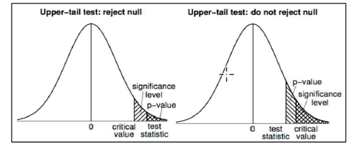

```{r setup, include=FALSE}
knitr::opts_chunk$set(echo = TRUE)
```

# 검정

추정보다는 쉬울 내용입니다! 추정은 되게 이론적으로 어떤 추정이 좋은 추정이고, 어떤 방식으로 추정하는지 논리를 전개하는게 입문 수준에서도 어느정도 가능하기 때문에 오히려 어려웠습니다. 또 추정에서 mle는 다른 분야에서도 많이 볼 수 있기 때문에 더 열심히 내용을 꾹꾹 눌러담았습니다. 그런데 기본적으로 검정 같은 경우, 입문에서 다루는 내용은 개별적인 평균과 분산에 대한 검정이고, 분석 방법들에서도 검정이 설계되지만 증명하는 것도 쉽지 않고, 그런 유도가 왜 일어났는지를 말하는 것도 쉽지 않습니다. 그래서 기존의 평균과 분산에 대한 검정을 담고, 왜 이런 검정이 이 상황에서 최선의 검정인지를 증명보다는 R 시뮬레이션을 통해 보여드리려고 합니다.

## 가설검정 Intro

가설검정은 모집단(모수)에 대한 어떤 가설을 설정하고, 그 모집단으로부터 추출한 표본을 분석함으로써 가설의 타당성 여부를 결정하는 것이다.

- 통계적 가설 : 단일 또는 여러 모수에 대한 '주장'
- 가설검정 : 표본을 관찰하여 가설을 '채택' 또는 '기각'의 결정을 내리는 분석방법

(ex) 권남택은 '성균관대 남학생들은 군대 이전보다 군대 이후 학점이 높다'고 주장한다. 과연 권남택의 주장이 타당한지 확인하는 것이 가설검정.

# 가설검정의 개념

## 가설의 종류

귀무가설($H_0$) vs 대립가설($H_1, H_a$)

- 귀무가설(영가설, Null Hypothesis) : 연구 과정에서 검정의 대상이 되는 가설, 기존에 알려진 사실을 간단하구 구체적으로 표현한 가설.
  - 귀무가설은 보통 $=$가 들어가는 형태로 만들고(그래야 설계가 편함!), 기존의 연구의 결과와 같이 어느정도 알려진 사실을 기반으로 만든다. 
  - ex) 권남택의 평균 주량은 소주 1병 반이다. $\rightarrow$ $H_0 :\mu=1.5$
  
- 대립가설(Alternative Hypothesis) : 귀무가설이 받아들여질 수 없을 때 대신 잠정적으로 수용하는 가설. 보통 연구자의 주장이 되는 가설이라고 하지만 100% 맞는 말은 아니다. 귀무가설로 지정되지 않는 모든 경우를 포괄하여 설정하게 된다.
  - ex) 권남택의 평균 주량이 1병 반은 아니다.$\rightarrow$ $H_1 : \mu \neq 1.5$
  - ex) 권남택의 평균 주량은 1병 반도 못먹는 낮은 술찌다.$\rightarrow$ $H_1 : \mu < 1.5$
  - ex) 권남택의 평균 주량은 1병 반 보다 기본으로 더먹는데... $\rightarrow$ $H_1 : \mu > 1.5$

우리는 보통 관심있는 쪽을 대립가설이라고 배운 경우가 많다. 최종 결론에 대한 부분은 그게 맞는 경우가 대부분이지만, 결론을 위한 가정들에 대해 통계적 검정을 하는 경우에는 반대가 되는 경우가 많다. 따라서 100% 맞는 말이 아니라는 정도만 생각해두자.

가설검정의 설계상 대립가설에 집중하는 것이 아니라, 귀무가설에 집중하는 것이다. 앞으로 표현할 때

- 틀린말 : '대립가설을 기각한다', '대립가설을 채택한다', '귀무가설을 채택한다'
- 맞는말 : '귀무가설을 기각하지 못한다', '귀무가설을 기각한다'

왜냐하면 귀무가설을 기각한다는 것은 귀무가설을 지지할만한 충분한 근거가 없다는 것이지, 대립가설이 맞다는 것이 아니다. 물론 실용적으로는 저 '틀린말'의 범주를 사용해도 큰 무리는 없지는, 원칙적으로는 적확한 표헌은 아니다. 그러므로 저런 실용적인 표현을 쓰더라도, 가능하면 원칙적인 표현을 먼저 언급한 후 사용하는 것이 쓸데없이 깐깐한 통계러들의 반론/비판/태클을 피할 수 있다.

## 검정통계량

검정통계량(Test Statistic) : 두 가설 중 하나를 결정하기 위해 사용되는 통계량이고, 확률표본의 관측값을 이용하여 계산한다.

- 모평균 $\mu$에 대한 검정통계량 : 표본평균 $\bar{X}$
- 모분산 $\sigma^2$에 대한 검정통계량 : 표본분산 $S^2$

검정통계량의 분포 : $H_0$ 하에서 정의된 모수값과 연계되어서 결정된다.
- ex) 모평균에 대해 다룰 때 $H_0 : \mu = 0$이라고 하면, 표본평균 $\bar{X}$의 분포는 다음과 같이 표현한다.
$$
\bar{X} \overset{\text{H0}}{\sim} N(\mu=0,\sigma^2), \quad or \quad\bar{X} \sim N(\mu=0,\sigma^2) \:\: under \: H_0
$$

## 오류 

당연히 우리는 표본에서 다루기 때문에 랜덤성에 따른 오차라는 것이 존재할 수 밖에 없다. 어떤 오류가 발생할 수 있는지를 살펴보자.

|                     |  $H_0$ 채택  | $H_0$ 기각                                |
| ------------------- | -------------|-------------------------- |
| $H_0$이 참일 때  | 옳은 결정 | 제 1종 오류 |
| $H_0$이 거짓일 때 | 제 2종 오류 | 옳은 결정 |

- 제 1종 오류(Type 1 error) : 귀무가설이 참임에도 귀무가설을 기각하는 오류
  - 제 1종 오류를 범할 확률 : $\alpha$
  - 
- 유의수준(Significance Level) : 제 1종 오류를 범할 확률의 허용 한계
- 제 2종 오류(Type 2 error) : 귀무가설이 틀림에서 귀무가설을 채택하는 오류
  - 제 2종 오류를 범할 확률 : $\beta$

|                     |  $H_0$ 채택  | $H_0$ 기각                                |
| ------------------- | -------------|-------------------------- |
| $H_0$이 참일 때  | $1-\alpha$ | $\alpha$ |
| $H_0$이 거짓일 때 | $\beta$ | $1-\beta$ (검정력) |

- $\alpha=P(Type\:1\:error)=P(Reject\: H_0|H_0 \: True)$
- $\beta=P(Type\:2\:error)=P(Do\:not\: reject\: H_0|H_0 \: False)$
- 검정력(Power) : 귀무가설 $H_0$이 거짓일 때, 귀무가설을 기각할 확률이다.

당연하게 $\alpha, \beta$는 낮으면 낮을수록 좋다. 하지만 둘 다 0으로 만드는 것은 불가능하다. 왜냐하면 둘은 반비례 관계에 있기 때문에, $\alpha$를 낮추려하면 $\beta$가 커진다. 다만 표본크기 n이 커지면 표본분포의 분산이 작아지므로, $\alpha, \beta$는 동시에 작아질 수 있다.

```{r figure1, echo = FALSE, fig.cap = 'alpha, beta', fig.align='center', out.width='70%'}

```

그래서 우리는 두 종류의 오류를 모두 작게할 수 없으니, 유의수준 $\alpha$를 고정한 상태에서 $1-\beta$(검정력)를 최대화하자. (검정의 핵심 아이디어!)

$\alpha$를 고정하는 시유 : 귀무가설이 참인데 귀무가설을 기각하는 현상은 우리가 최대한으로 기피해야 하는 상황. 그래서 우리는 $\alpha$를 0.05로 보통 고정하고 가설 검정을 설계한다. 0.05로 잡는 이유는 그냥 관습적이기 때문에, 다소 기준이 낮다는 의견도 매우 많다. 아무튼 유의수준의 크기를 작게 고정해서, 제 1종 오류의 발생확률을 낮춰서 더 엄격한 검정을 한다.

$1-\beta$를 최대화하는 이유 : 귀무가설일 참일 때 귀무가설을 채택하는 것이 옳은 검정으로, 연구자가 원하는 방향으로의 옳은 결정이다. 가설검정을 하는 것은 지금까지 알려진 모수가 기존과 다르다는 생각이 기반에 자리한다. 그러면 '다른 것은 다르다'라고 결과가 나올 수 있어야하기 때문에 검정력을 최대화하려한다.

## 기각의 기준

임계값(Critical Value) : 주어진 유의수준 $\alpha$ 하에서 귀무가설 $H_0$의 채택 또는 기각 여부를 판정해주는 기준이 되는 값

(ex) 권남택의 평균 주량이 1.5병이라는 이야기를 듣고 누군가 권남택은 그거보다 더 먹는다고 말했다. 그러면 이에 대한 가설을 세울 때 $H_0:\mu=1.5 \:\: vs \:\: H_1:\mu>1.5$로 세울 것이고, 이를 판단하는 검정통계량은 $\bar{X}$일것이고, $\bar{X} \geq c$ ($c$는 임계값) 일때 귀무가설을 기각하기로 했다. 이 임계값 $c$는 유의수준 $\alpha$과 표본크기 $n$, 검정통계량의 분포를 고려해서 정해진다.

```{r figure2, echo = FALSE, fig.cap = 'critical value', fig.align='center', out.width='80%'}

```

기각역(Rejection Region) : 귀무가설 $H_0$을 기각하는 영역. 임계값을 기준으로 생성이 된다.

- 채택역(Acceptance Region) : 귀무가설 $H_0$을 기각하지 않는 영역. 하지만 채택이라는 표현이 통계적으로 잘 쓰이지 않다보니, 잘 사용하지 않는 단어다. 기각역으로만 공부하자.
- 기각역은 가설의 형태에 따라 달라진다. 가설의 형태를 다음 표를 통해 확인하자.

```{r figure3, echo = FALSE, fig.cap = 'Direction of Hypothesis', fig.align='center', out.width='95%'}

```

```{r figure4, echo = FALSE, fig.cap = 'Visualization of Rejection Region', fig.align='center', out.width='80%'}

```

귀무가설을 기각 or 기각하지 못함에 대한 결정 방법 과정을 정리하자.

1) 우리가 추출한 표본으로 검정통계량을 계산하고,
1) 그 검정통계량 값이 기각역 안에 있다면 $H_0$을 기각하고, 기각역에 안에 없다면 $H_0$을 기각하지 않는다.

이것이 가장 교과서적인 방법이지만, 더 직관적인 방법으로 P-value를 보는 방법이 있다.

## P-값(P-value)

P-값은 귀무가설이 참이라는 전제하에, 표본에서 관측된 통계치와 같거나 혹은 더 극단적인 통계치가 관측된 확률이다. 이는 귀무가설 하의 분포에서 계산한 확률값에 불과할 뿐, 실제 가설검정에 대한 확률로서 받아들여선 안된다. 모수를 고정된 값으로서 가정(그렇게 인식해오지 않았더라도)하기 때문에, 모수와 관련한 가설검정에 대한 확률이 아니다. P-value 값이 0.01이 나왔다고 해서 '귀무가설을 기각할 확률이 0.01'이라고 하면 절대 안된다! P-value에 대한 잘못된 이해가 매우 많기 때문에 이부분을 명확히 하고자 하고, 다만 P-value를 사용함으로써 더 쉽게 가설의 기각 여부를 받아들일 수 있을 뿐이다.

P-value가 우리가 설정한 유의수준 $\alpha$보다 낮다면 귀무가설을 기각하고, 유의수준 $\alpha$보다 크다면 귀무가설을 기각하지 못한다고 외우자. P-value가 유의수준보다 작다면 기각역 안에 있는 것이고, P-value가 유의수준보다 크다면 기각역 밖에 있기 때문이다. 이를 시각적으로 이해하자.

```{r figure5, echo = FALSE, fig.cap = 'Lefi-sided test', fig.align='center', out.width='80%'}

```

```{r figure6, echo = FALSE, fig.cap = 'Right-sided test', fig.align='center', out.width='80%'}

```

```{r figure7, echo = FALSE, fig.cap = 'Two-sided test', fig.align='center', out.width='80%'}

```

$$
\vspace{7\baselineskip}
$$

정리하기 위해서 마지막 사진을 보고, 이제 실제 검정 예시들을 보자!

```{r figure8, echo = FALSE, fig.cap = 'Concept of Test', fig.align='center', out.width='80%'}

```

# 각 예시를 보기 전에...

## 가설검정의 절차

1) 가설설정 : 분석하고자 하는 목적에 따라 귀무가설 $H_0$과 대립가설 $H_1$을 설정
1) 유의수준 $\alpha$와 표본크기 $n$ 결정
1) 검정통계량과 분포 설정 : 귀무가설 하에서 적절한 검정통계량 $T(X_1,X_2, \cdots,X_n)$과 $T$의 분포를 결정
1) 임계값 및 기각역 결정 : 연구자가 설정한 유의수준 $\alpha$와 표본크기 n에 따라 결정
1) 검정통계량 $T$ 계산 : 관측된 값을 이용해 $t$를 계산.
1) 의사결정 : $t$가 기각역에 있다면 $H_0$을 기각. 기각역 밖에 있다면 $H_0$을 기각하지 못한다.

## 구간추정과 가설검정의 관계

- 구간추정의 신뢰구간 = 가설의 기각역 외부(채택역)
- 신뢰구간 내에 우리가 귀무가설에서 가정한 모수의 값 $\mu_0$가 있을 경우, $H_0$을 기각하지 못한다..
- 신뢰구간 내에 우리가 귀무가설에서 가정한 모수의 값 $\mu_0$가 없을 경우, $H_0$을 기각한다.

## 앞으로의 가설검정

우리가 다룰 가설검정은 기본적으로 모수적인 검정을 한다. 모수적인 검정은 분포를 가정해서, 분포를 통해 기각역을 설정하는 것이다. 반면에 비모수적 검정은 관측치가 적어서($n<30$) 중심극한정리를 통한 근사가 불가능해서 데이터의 순위/순서와 같은 값을 사용해 계산한다. 비모수 검정보다는 모수적 검정이 훨씬 간단하고 이해가 편하기 때문에, 이를 위주로 설명할 예정이다.

그래서 우리가 앞으로 $t$검정을 한다고하면, $t$분포를 활용한 가설검정을 한다는 뜻이다. $z$검정은 표준정규분포, $\chi^2$ 검정은 카이제곱분포, $F$검정은 $F$분포를 사용해 검정을 진행한다.

또한 이런 통계학 입문수준에서 다루는 검정은 기본적으로 단일표본(집단이 1개)인 경우와 이표본(집단이 2개)인 경우로 나눠서 진행하게 된다. 집단이 더 많은 경우, 분산분석(Analysis of Variance, ANOVA)를 통해 집단간 차이가 있는지 검정하지만 다루지 않는다.

# 단일 표본 검정

## 단일표본 모평균 검정

- 가설검정 대상 : 모평균
- 귀무가설과 대립가설 :
$$
H_0:\mu=\mu_0 \quad vs \quad H_1:\mu \neq\mu_0\:\:(\text{or}\quad\mu>\mu_0\quad \text{or} \quad \mu<\mu_0)
$$
### 모분산을 알 때

1) 검정통계량 : $z_0=\frac{\bar{X}-\mu_0}{\sigma/\sqrt{n}}$
1) 검정통계량의 분포 : $N(0,1)$  ($\because \bar{X} \sim N(\mu_0, \frac{\sigma^2}{n})$이기 때문에 $\bar{X}$를 표준화 시킨것!)
1) 기각역 : 양측검정 - $|z_0|>z_{\alpha/2}$, 우측검정 - $z_0>z_{\alpha}$, 좌측검정 - $z_0<z_{\alpha}$

### 모분산을 모를 때

사실 모분산을 안다는 것은 비현실적인 가정이다. 모집단을 다 관측할 수 없기 때문에 당연히 모수는 모른다. 하지만 계산의 편의성을 이유로 위의 방식을 소개했다. 현실적으로는 모분산을 모르는 상황에서 $t$검정을 수행하는 것이 맞다.

1) 검정통계량 : $t_0=\frac{\bar{X}-\mu_0}{S/\sqrt{n}}$
1) 검정통계량의 분포 : $t_{n-1}$  ($\because \bar{X} \sim N(\mu_0, \frac{\sigma^2}{n}), \quad (n-1)\frac{S^2}{\sigma^2}\sim\chi^2_{n-1}$)
1) 기각역 : 양측검정 - $|t_0|>t_{\alpha/2,n-1}$, 우측검정 - $t_0>t_{\alpha, n-1}$, 좌측검정 - $t_0<z_{\alpha, n-1}$

하지만 이렇게 모분산을 모르더라도 $n\geq30$이면 정규분포를 이용해 근사할 수 있다고 많은 교과서에 나와있다. 이를 시뮬레이션으로 확인하자.

$N(1,2^2)$을 따르는 난수를 생성하고, 이 행동을 10000번씩 반복해서 시뮬레이션을 돌린다.

```{r}
set.seed(0)
mu <- 1
sigma <- 2
N = 10000
storage_mat <- matrix(nrow = N, ncol = 2)
for (k in 1:10000) {
  x <- rnorm(65, mu, sigma)
  storage_mat[k, 1] <- mean(x) - sd(x) * qt(0.975, 64) / sqrt(65) #lower bound
  storage_mat[k, 2] <- mean(x) + sd(x) * qt(0.975, 64) / sqrt(65) #upper bound
}
head(storage_mat) 
mean(storage_mat[, 1] < 1 & storage_mat[, 2] > 1)

# z검정 사용
for (k in 1:10000) {
  x <- rnorm(65, mu, sigma)
  storage_mat[k, 1] <- mean(x) - sd(x) * qnorm(0.975) / sqrt(65) #lower bound
  storage_mat[k, 2] <- mean(x) + sd(x) * qnorm(0.975) / sqrt(65) #upper bound
}
mean(storage_mat[, 1] < 1 & storage_mat[, 2] > 1) 
```

유의수준의 오차가 t검정보다 z검정이 커보이지만, 그래도 크게 차이가 안나기 때문에 무리 없이 사용한다고 볼 수 있다. 만약 $n \leq30$이면 어떻게 될까?

```{r}
set.seed(0)
mu <- 1
sigma <- 2
N = 10000
storage_mat <- matrix(nrow = N, ncol = 2)
for (k in 1:10000) {
  x <- rnorm(25, mu, sigma)
  storage_mat[k, 1] <- mean(x) - sd(x) * qt(0.975, 24) / sqrt(25) #lower bound
  storage_mat[k, 2] <- mean(x) + sd(x) * qt(0.975, 24) / sqrt(25) #upper bound
}
mean(storage_mat[, 1] < 1 & storage_mat[, 2] > 1)

# z검정 사용
for (k in 1:10000) {
  x <- rnorm(25, mu, sigma)
  storage_mat[k, 1] <- mean(x) - sd(x) * qnorm(0.975) / sqrt(25) #lower bound
  storage_mat[k, 2] <- mean(x) + sd(x) * qnorm(0.975) / sqrt(25) #upper bound
}
mean(storage_mat[, 1] < 1 & storage_mat[, 2] > 1) 

```

유의수준 $\alpha$가 0.05로 고정되지 않고, 더 커진다. 이는 곧 제 1종 오류의 발생가능성이 증가함을 의미한다. 따라서 n이 작을 경우, 모평균에 대한 검정에서 t검정을 z검정으로 근사하면 안된다.

단일모평균 가설검정 | 검정통계량(Test Statistics) | 검정통계량의 분포(Under $H_0$) |
--------------------------------- | --------------------------------- | ----------------------------- |
모분산 $\sigma^2$을 아는 경우 | $z_0=\frac{\bar{X}-\mu_0}{\sigma/\sqrt{n}}$ | $N(0,1)$ |
모분산 $\sigma^2$을 모르는 경우 & large n | $z_0=\frac{\bar{X}-\mu_0}{\sigma/\sqrt{n}}$ | $N(0,1)$ | 
모분산 $\sigma^2$을 모르는 경우 | $t_0=\frac{\bar{X}-\mu_0}{S/\sqrt{n}}$ | $t_{n-1}$ |

## 단일표본 모분산 검정

- 가설검정 대상 : 모분산
- 귀무가설과 대립가설 :
$$
H_0:\sigma^2=\sigma^2_0 \quad vs \quad H_1:\sigma^2 \neq\sigma^2_0\:\:(\text{or}\quad\sigma^2>\sigma^2_0\quad \text{or} \quad \sigma^2<\sigma^2_0)
$$

| ------ | 양측검정 | 우측검정 | 좌측검정 |
| ------------- | -------------------------------- | ----------------------------- | ------------------------- |
| 가설 | $H_1:\sigma^2 \neq\sigma^2_0$ | $H_1:\sigma^2 > \sigma^2_0$ | $H_1:\sigma^2 < \sigma^2_0$ |
| 기각역 | $\chi^2_0 \geq \chi^2_{\alpha/2, n-1}$ or $\chi^2_0 \leq \chi^2_{1-\alpha/2, n-1}$ | $\chi^2_0 \geq \chi^2_{\alpha, n-1}$ | $\chi^2_0 \leq \chi^2_{\alpha, n-1}$ |

$H_0$하에서 검정통계량의 분포 : $\chi^2_0 = \frac{(n-1)S^2}{\sigma^2_0} \sim \chi^2_{n-1}$

# 이표본 검정

## 독립 이표본 모평균 검정

- 가설검정 대상 : 각 모평균 $\mu_1, \mu_2$
- 귀무가설과 대립가설 :
$$
H_0 : \mu_1-\mu_2=d_0 \quad vs \quad H_1:\mu_1-\mu_2 \neq d_0 \quad(> \: or \: <)
$$

보통 $d_0=0$으로 높고, 두 모평균이 같은지, 어느 한쪽이 큰지를 검정하는 경우가 많다.

### 모분산을 알 때

1) 검정통계량 : $Z_0=\frac{(\bar{X}-\bar{Y}) -d_0}{\sqrt{\frac{\sigma^2_1}{n_1} + \frac{\sigma^2_2}{n_2}}}$
1) 검정통계량의 분포 : $N(0,1)$  ($\because \bar{X}-\bar{Y}$를 표준화했기 때문)
1) 기각역 : 양측검정 - $|z_0|>z_{\alpha/2}$, 우측검정 - $z_0>z_{\alpha}$, 좌측검정 - $z_0<z_{\alpha}$

### 모분산을 모르지만 동일하다고 가정할 때

두 집단의 모분산이 같다는 가정을 한다. $\sigma_1^2=\sigma_2^2=\sigma^2$ 이를 이후에 다룰 이표본 분산비 검정을 통해 확인한 후, 검정을 진행하는 것이 일반적이다.

1) 검정통계량 : $T_0=\frac{(\bar{X}-\bar{Y}) -d_0}{S_p\sqrt{\frac{1}{n_1} + \frac{1}{n_2}}}, \quad\text{where}\quad S_p^2=\frac{(n_1-1)S_1^2+(n_2-1)S_2^2}{n_1+n_2-2}$
  - 이때 $S_p^2$를 합동분산(Pooled Variance)라고 한다. 
1) 검정통계량의 분포 : $t_{n_1+n_2-2}$
1) 기각역 : 양측검정 - $|t_0|>t_{\alpha/2,n_1+n_2-2}$, 우측검정 - $t_0>t_{\alpha, n_1+n_2-2}$, 좌측검정 - $t_0<z_{\alpha, n_1+n_2-2}$

```{r}
set.seed(42)
x = rnorm(30, 30, 3)
y = rnorm(40, 20, 3)
t.test(x, y, alternative = 'two.sided', # greater, less
       mu = 0, # difference 지정
       paired = F, # 대응표본검정일때 T
       var.equal = T, # 등분산 여부
       conf.level = 0.95) # 신뢰수준
```

### 모분산도 모르고, 분산이 서로 다를 경우

이후에 다룰 이표본 분산비 검정에 의해 등분산 가정이 기각될 경우, 이 방법으로 독립 이표본 모평균 검정을 시행한다.

1) 검정통계량 : $T_0=\frac{(\bar{X}-\bar{Y}) -d_0}{\sqrt{\frac{S^2_1}{n_1} + \frac{S^2_2}{n_2}}}$
1) 검정통계량의 분포 : $t_{v}$,  $v$ : 웰치의 조정자유도로, 딱 정수가 나오지 않을 수 있다.
1) 기각역 : 양측검정 - $|t_0|>t_{\alpha/2,v}$, 우측검정 - $t_0>t_{\alpha, v}$, 좌측검정 - $t_0<z_{\alpha, v}$

이방식으로 해결하는 것을 웰치방법, 세터스웨이드 근사 등등의 표현을 사용한다. 실제 $t$분포를 따르는 것이 아니라, 근사하는 형태이긴하다.

```{r}
set.seed(42)
x = rnorm(30, 30, 3)
y = rnorm(40, 20, 5)
t.test(x, y, alternative = 'two.sided', # greater, less
       mu = 0, # difference 지정
       paired = F, # 대응표본검정일때 T
       var.equal = F, # 등분산 여부
       conf.level = 0.95) # 신뢰수준
```


## 이표본 모분산비 검정

우리가 지금까지 모평균을 비교할때는 뺄셈을 통해 비교했다. 그런데 모분산간에 검정을 할때는 나눗셈을 이용한다. 왜냐하면 각각의 표본분산관 관련한 통계량이 카이제곱분포를 따르기 때문에, 카이제곱분포의 비로 나타나는 것이 바로 F분포이기 때문이다. 그래서 우리는 모분산에 차이가 있는지를 검정할 때, 각각의 모분산의 비를 이용해 F분포를 유도해서 구하게 된다.

$$
\begin{aligned}
&X_1,\cdots,X_{n_1} \sim N(\mu_1, \sigma^2_1), \quad &Y_1, \cdots, Y_{n_2}\sim N(\mu_2,\sigma^2_2) \\
&U=\frac{(n_1-1)S^2_1}{\sigma^2_1} \sim \chi^2_{n_1-1}, \quad\quad &V=\frac{(n_2-1)S^2_2}{\sigma^2_2} \sim \chi^2_{n_2-1} \\
&F=\frac{U/(n_1-1)}{V/(n_2-1)}=\frac{S_1^2/\sigma^2_1}{S_2^2/\sigma^2_2} \sim F_{n_1-1, n_2-1}
\end{aligned}
$$

귀무가설 $H_0$ : $\sigma_1^2 = \sigma_2^2$, 즉 두 집단의 분산이 동일하냐 아니냐

검정통계량은 $H_0$ 하에서 계산되므로, $\sigma_1^2 = \sigma_2^2$를 위 식에 넣으면, 검정통계량 
$$
F_0 = \frac{S_1^2}{S_2^2} \sim F_{n_1-1, n_2-1}
$$
가 된다. 이를 이용해서 검정을 진행하면 된다.

```{r}
set.seed(42)
a = rnorm(100, 30, 3)
b = rnorm(100, 20, 5)
var.test(a, b, ratio = 1,
         alternative = 'two.sided')
```


# 검정의 설계

지금까지 우리는 가장 기본적인 평균과 분산에 대항 검정을 진행했다. 지금까지 밝힌 내용은 매우 간단한 검정들의 예시로, 나중에는 '데이터가 정규분포를 따르는지', '데이터간에 독립적인지'와 같이 통계적인 가정들에 대해 통계적인 검정들을 진행한다. 각각의 검정들이 어떤 form을 지니는지 아는 것도 중요하지만, 그렇다면 왜 그런 form을 지니게 되었는지를 아는 것도 중요하다. 

왜 저런 형태가 만들어진 것일까? 우리가 하는 검정이 과연 최적의 검정일까?

 - 이런 질문은 통계학 입문에서 다루지 않는다. 수리통계학 후반부에서 다루고, 검정의 목표와 아이디어(유의수준 고정후 검정력 최대화), 검정의 설계를 설명한다. 이는 수학적으로 다소 어려우면서, 계산이 복잡하기 때문에 입문에서 저 질문을 다룰 수 없다고 생각된다.
 
## 왜 저런 형태가 만들어질까?

많은 검정들은 귀무가설에서의 가능도와 전체 모수공간에서의 가능도를 비교해서 진행된다. 우리가 추정에서 가능도를 최대로 하는 모수를 선택했듯이, 검정에서도 가능도를 사용한다. 이런 검정 방법을 '가능도비 검정'(Likelihood Ratio Test, LRT)라고 한다. $H_0$하에서 가능도와 전체 모수공간 $\approx H_1$에서의 가능도를 비교해서, 그 차이가 통계적으로 유의하면(기각역 안에 들어가면) 귀무가설을 기각하게 된다. 가장 기본적인 분산을 알 때 일표본 모평균에 대한 검정을 유도해보자.

$$
\vspace{10\baselineskip}
$$

## 저 검정이 최적의 검정인가?

네! 고정된 유의수준 $\alpha$ 하에서 최고의 검정력 $1-\beta$을 발휘하는 검정 중 하나다. 가장 직관적인 관점에서 만들 수 있는 검정이기 때문에, 많은 검정들이 이를 바탕으로 만들어진다. 


