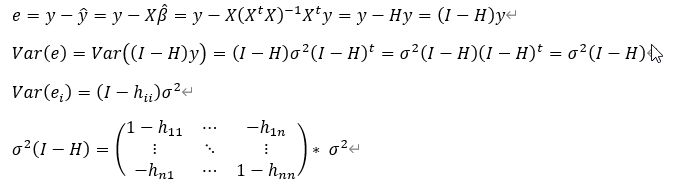

```{r setup, include=FALSE}
knitr::opts_chunk$set(echo = TRUE)
```

# 기본 수식

## 기초 수식

- 표본 평균 (Sample Mean)

$$
\bar{x} = \frac{1}{n}\sum_{i=1}^n x_i, \quad \bar{y}=\frac{1}{n}\sum_{i=1}^n y_i
$$

- 표본 분산 (Sample Variance)

$$
S^2 = \frac{1}{n-1}\sum_{i=1}^n (x_i-\bar{x})^2
$$

- 표본 표준편차 (Sample Standard Deviation)

$$
S = \sqrt{\frac{1}{n-1}\sum_{i=1}^n (x_i-\bar{x})^2}
$$

- $S_{xx}$와 $S_{xy}$ (변동)

$$
S_{xx}=\sum_{i=1}^n (x_i-\bar{x})^2, \quad \quad S_{xy} = \sum_{i=1}^n (x_i-\bar{x})(y_i-\bar{y})
$$

## 공분산 (Covariance)

공분산은 두 확률변수가 얼마나 상관성을 띄는지 나타내는 지표이다. 두 변수의 선형관계를 나타내지만, 얼마나 선형성을 갖는지에 대한 '강도'를 표현하지 못한다. 값은 $-\infty$부터 $\infty$까지 가질 수 있다.

$$
Cov(X,Y)=\frac{1}{n-1}\sum_{i=1}^n (x_i-\bar{x})(y_i-\bar{y})
$$

확률변수의 단위에 영향을 받는 지표이다. 공분산을 통해 상관성의 형태에 대해 짐작할 수 있지만, 강도에 대해 비교하는 것은 불가능하다.

## 상관계수

공분산의 단점을 보완해줄 수 있는 지표로서, '표준화된 공분산'으로 이해할 수 있다.

$$
corr(X,Y)=r_{xy}=\frac{Cov(X,Y)}{\sqrt{Var(X)}\sqrt{Var(Y)}} = \frac{\sum(x_y-\bar{x})(y_i-\bar{y})}{\sqrt{\sum(x_i-\bar{x})^2}\sqrt{\sum(y_i-\bar{y})^2}}
$$

-1부터 1의 값을 갖고, 1이면 완전한 상향직선, -1이면 완전한 하향직선의 형태이다. 0이면 아무런 선형관계가 없다. 즉, Zero Correlation이더라도, 선형관계 이외의 비선형 관계가 있을 수 있다.

```{r, echo = FALSE, fig.cap = 'correlation coefficient', fig.align='center', out.width='70%'}

```

# 회귀분석이란?

## 회귀분석이란?

변수들 사이의 관계를 모델링하는 통계적 기법 by Duglas C. Montgomery 

- 예) 전통적인 주제 : 흡연과 폐암은 관련있을까?
-	예) 남택의 음주량과 학점은 관련이 있을까?

회귀분석은 Francis Galton으로부터 시작되었다. 아버지의 신장(X)와 자녀의 신장(Y) 간의 관계식을 연구했는데, 산점도를 그려본 결과 완만한 직선을 중심으로 점들이 분포해 있었다. 그리고 그 추세선은 언제나 X와 Y의 평균을 지나고 있었다. 예를 들어 자녀 세대의 평균 신장이 172cm라고 하면, 아버지의 신장이 160cm일 때 자녀들의 평균 신장은 168cm 정도로 아버지보다 컸다.  또한 아버지의 신장이 180인 경우 자녀들의 평균 신장은 175cm로 아버지보다 작았다. 이렇듯 키가 큰 부모에게서 키가 큰 자녀가 태어나고 키가 작은 부모에게서 키가 작은 자녀가 태어나지만, 태어난 자녀들의 평균 키는 전체 평균 수준으로 회귀(돌아가다)하는 현상을 보인다.

우리가 관심있는 반응변수(Response) Y와 설명변수(Predictor, Feature) X의 방정식 형태

- $Y = f(X_1,X_2,\cdots,X_p)+\epsilon$
- $\epsilon$은 회귀모델의 오차항, 무작위(설명되지 않는) 오차의 형태

데이터가 주어졌을 때, 우리가 관심있는 것을 예측하고 해석하기 위한 기본적인 모델이다.

## 상관분석과의 차이

회귀분석은 기본적으로 변수들 사이의 상관관계에 기반한 모델이다. 그리고 회귀분석 이외의 머신러닝, 딥러닝 모델들도 다 상관관계에만 기반한 모델이다. 이렇게 상관관계에만 기반할거면 ‘상관분석’만 하면 되지 않을까?

상관분석의 한계

- 상관관계는 두 변수간의 관계밖에 표현할 수 없다.
- 두 변수의 선형적 상관성의 정도만 표현할 수 있고, 구체적 예측과 설명이 불가능
-	‘남택의 음주량은 학점과 상관성이 높다’ 만으로는 의미를 갖기 어려움. 
  - 남택이가 한 주에 술을 두 번 마신다면, 학점이 어떻게 변화할지를 알 수 있어야 유의미한 정보를 갖춘 것.

## 회귀모델링의 과정

1) 문제 정의
-  주희의 학점을 가장 잘 표현할 수 있는 변수들은 무엇이 있을까?
2) 예상되는 적절한 변수들 선택
-  X1~Xp : 통학 거리, 주당 술자리 횟수, 학회 여부
3) 데이터 수집 및 전처리
-  주희의 학점, 집주소와 학교 사이의 거리 계산, 술자리 사진으로 횟수 추정
4) 모형 설정과 적합
-  적절한 회귀분석 모델 선택. 
-  선형 vs 비선형, 단순회귀 vs 다중회귀 등 고려
-  $\hat{y}=\hat{\beta_0} + \hat{\beta_1}x_1 +\cdots+\hat{\beta_p}x_p$
5) 모형 평가와 해석
-  모형이 회귀 가정을 만족하는가? 만족하지 않으면 수정 (2주차 참고!)
-  매주 2회 술 먹고, 현재 거주지에서 통학하며 학회할 때 학점은 평균적으로 4.2 정도 나올 것이다

# 단순선형회귀분석

## 단순선형회귀식

단순 선형 회귀(Simple linear reg)에 대해 알아보자. X와 Y의 관계를 가장 잘 표현할 수 있는 직선을 찾는다. 주어진 데이터를 가장 잘 설명할 수 있는 직선을 찾아 수식으로 표현한다.

$$
\vspace{7\baselineskip}
$$

```{r, echo = FALSE, fig.cap = 'regression line', fig.align='center', out.width='70%'}

```

notation(표기)

- $y_i$ : 반응변수 y의 i번째 관측값
- $x_i$ : 설명변수 x의 i번째 관측값
- $\epsilon_i$ : i번째 관측값에 의한 랜덤오차로, 평균은 0이고 분산은 $\sigma^2$
  - $\epsilon_i \sim NID(0, \sigma^2)$, NID = Normally and Independently Distributed
- $\beta_0,\beta_1$ : 회귀계수라고 하고, 추정해야할 모수이다. 
  - 회귀계수를 잘 추정하는것은 더 좋은 모델을 위해 필수적이다. 추정 방법은 뒤에서 다루자.

sample regression model : $y_i=\beta_0+\beta_1 x_i + \epsilon_i$

Mean of model : $E(y|x)=\beta_0+\beta_1x$

- 평균적으로 저 직선 주위에서 데이터들이 있다.

Variance of model : $Var(y|x)=Var(\beta_0+\beta_1 x + \epsilon) = \sigma^2$

- 데이터들이 떨어진 정도는 일정하다.

단순선형회귀 모델의 해석

- x가 한 단위 증가할 때, y는 $\beta_1$만큼 평균적으로 증가한다. 마치 우리가 중학교때 배운 일차함수와 다를 바 없다. 물론 딱 $\beta_1$만큼 증가하는 것이 아니라, **평균적으로** $\beta_1$만큼 증가한다는 것.

왜 직선으로 표현하는가?

- 변수의 영향력을 간단하게 모형화 할 수 있다. 해석이 매우 간편하고, 추정도 매우 쉽다.

```{r, echo = FALSE, fig.cap = 'regression line2', fig.align='center', out.width='70%'}

```

- 선형근사를 넘어서 고차근사를 할 경우, 모델의 복잡도가 높아진다. 당장의 데이터는 잘 설명하더라도, 일반화되있지 않을 수 있다.

```{r, echo = FALSE, fig.cap = 'Concept of fitting', fig.align='center', out.width='70%'}

```

- 물론 현실의 데이터는 선형적으로 생성되지 않는 경우가 훨씬 많다. 따라서 단순 선형회귀식은 예측 성능이 떨어지는 경우도 많다. 하지만 기본적으로 선형회귀식의 원리와 가정, 변형을 통해 우리가 궁극적으로 하고자 하는 예측 모델링에 대한 전체적인 흐름을 이해할 수 있고, 머신러닝 방법들에 대한 총체적인 이해에 도움을 준다.
- 더불어서 선형모델은 데이터 수가 적은 경우($n<5000$)나 데이터 수에 비해 변수의 개수가 매우 많은 경우($n<<p$) 매우 성능이 좋다.

## 모수의 추정 - 최소제곱법(Least Square Method)

우리가 알고 싶은, 가정하는 회귀식의 형태는 $y_i= β_0+ β_1 x_i+ ε_i$이다. 하지만 이는 참회귀식(True Model)로 알 수 없다. 다만 실제 데이터가 생성되는 형태를 선형으로 가정했기 때문에, 주어진 데이터를 통해 데이터가 생성되는 형태를 ‘추정(estimation)’할 수 있을 뿐이다.

- 추정해야 할 모수는 현재 $β_0,β_1,σ^2$, 하지만 $β$ 추정에만 집중하자! 회귀직선만 잘 만들어내면 $σ^2$의 추정은 어렵지 않다. 원래 우리 목표는 데이터를 가장 잘 표현하는 직선을 찾는거니까!! 그렇다면 어떤 추정이 좋은 추정일까?

```{r, echo = FALSE, fig.cap = 'Concept of LSE', fig.align='center', out.width='70%'}
knitr::include_graphics('pic/K-081.png')
```

- 직관적으로 우리가 만들어낼 회귀 직선과 관측치 사이의 오차가 작으면 작을수록 좋다. 그렇다면 이 오차를 최소화하면 어떨까?

- 딱 보니까 오차의 합은 0이겠지? 절대적인 떨어짐(deviation)을 최소화하는 방법이 필요하다. 우리는 보통 이럴 때 절대값을 씌우기보다는 제곱한다. 따라서 ‘오차제곱합’을 최소화하고, 이를 ‘최소제곱법(LSE)’라고 한다. 

$$
S(\beta_0, \beta_1)=\sum_{i=1}^n (y_i-\beta_0 - \beta_1x_i)^2 = \sum_{i=1}^n \epsilon_i^2
$$

- 이런 제곱꼴의 함수는 아래로 볼록한 함수이다. 우리는 고등학교 때, 어떤 '미분가능한 함수'의 최소값/최대값을 구할때, 미분값 = 0을 통해 찾았다. 현재 형태가 이차함수 $y=x^2$와 같은 형태이므로, 다른 고려없이 미분값=0을 취하면 된다.

$$
\begin{aligned}
\frac{\partial S}{\partial \beta_0} &= -2\sum_{i=1}^n (y_i-\hat{\beta_0}-\hat{\beta_1}x_i)=0 \\
\frac{\partial S}{\partial \beta_1} &= -2\sum_{i=1}^n (y_i-\hat{\beta_0}-\hat{\beta_1}x_i)x_i=0
\end{aligned}
$$

- 그래서 이 방법으로 $β_0,β_1$의 추정치를 얻을 수 있고, 이를 ‘최소제곱추정치(Least Square Estimator, LSE)’라고 한다.

$$
\hat{\beta_0}=\bar{y}-\hat{\beta_1}\bar{x}, \quad\quad \hat{\beta_1}=\frac{S_{xy}}{S_{xx}}
$$

왜 오차제곱합을 최소화할까?

- 미분이 편리하다. 미분값=0을 통해 바로 추정할 수 있기 때문에 매우 간단. 

```{r, echo = FALSE, fig.cap = 'loss function of LSE', fig.align='center', out.width='70%'}

```

-	오차가 클수록 더 큰 페널티를 부여할 수 있다. 중심에서 멀어질수록 기울기가 상승하고 있죠? 인정할 수 있는 정도의 오차의 영향력은 줄이고, 인정할 수 없는 오차의 영향력은 높이는 방법. 

## LSE의 가정과 특징

### 가정

LSE 방법은 그냥 사용이 가능하다. 하지만 다음의 조건이 갖춰질 경우 특별하고도 매우 유용한 성질을 지닌다. 

1) 오차들의 평균은 0, 
2) 오차들의 분산은 σ^2으로 동일 (등분산)
3) 오차간에는 자기상관이 없다(uncorrelated)

이 조건들을 만족하면 최소제곱추정량은 BLUE가 된다. Best(분산이 제일 작은) Linear(선형) Unbiased Estimator(불편추정량)으로, 다른 선형불편추정량보다 분산이 늘 작다! BLUE만을 생각했을 때는 **정규성은 필요하지 않다.** 즉 저 3가지 조건만 만족하면, 우리의 추정량은 정말 좋은 추정량이다. 

### MLE와 LSE의 관계

그렇다면 우리가 3회차에 배운 최대가능도추정(ML추정)과 어떤 관련이 있을까? 최대가능도 추정이 늘 좋다며?

- 최대가능도 추정은 확률적인 방법에 근거해서, 어떤 모수가 주어졌을 때, 우리 데이터가 나올 ‘가능도’를 최대로 하는 모수를 선택하는 방법이다.
- 그런데 이런 ML방법은 언제나 분포 가정이 들어간다.  회귀분석에서는 오차 $ε_i  \sim N(0,σ^2)$ 이라는 가정이 들어가면, ML방법을 적용 가능하다.
- 그래서 MLE와 LSE가 다르냐? 정규분포 가정이 있다면 완전히 동일한 추정량을 산출한다. 그냥 구하려는 아이디어만 다를 뿐, 수식마저 같은 형태다. 

## 적합성(Goodness of fit) 검정

### 잔차

지금까지 우리는 회귀계수 beta를 추정했다. 그렇다면 이 추정된 회귀계수를 바탕으로 회귀식을 만들 수 있고, 이 회귀식이 얼마나 우리 데이터를 잘 설명하는지가 궁금하다. 지금까지 오차에 대해 이야기했지만, 오차 $ε_i$도 $β$처럼 참회귀식에서 만들어지는 오차다. 우리 데이터들의 공간에서는 이 오차가 실현되는게 아니기 때문에, ‘오차의 추정량’으로서의 잔차를 정의한다. 결과적으로 오차와 잔차는 다를 바 없지만, 모집단과 표본의 차이라고 생각하면 된다.
 
$$
e_i=y_i-\hat{y_i}=y_i-\hat{\beta_0}-\hat{\beta_1}x_i, \quad\quad \sum e_i=0
$$

그렇다면 이 잔차를 통해 우리의 회귀식이 얼마나 적절한지 알아보자.

- SST(Total Sum of Squares, 총 변동) : $\sum (y_i-\bar{y})^2$
- SSR(Regression Sum of Squares, 회귀직선이 설명하는 변동) : $\sum (\hat{y_i}-\bar{y})^2$
- SSE(Residual Sum of Squares, 잔차제곱합, 회귀직선이 설명하지 못하는 변동) : $\sum (\hat{y_i}-y_i)^2$
- SST = SSR + SSE,  증명은 생략하고 그림으로 이해하자.

$$
\vspace{7\baselineskip}
$$

```{r, echo = FALSE, fig.cap = 'loss function of LSE', fig.align='center', out.width='70%'}

```

- 결정계수 : $R^2 = \frac{SSR}{SST}=1-\frac{SSE}{SST}$
- 결정계수는 총 변동에서 회귀식이 설명하는 비율을 나타내고, 1에 가까울수록 좋다. 즉 Y가 X에 의해 설명되는 비율이다.

## 유의성 검정

우리는 오차항의 평균을 0, 분산을 $\sigma^2$인 정규분포를 따른다고 가정했다. $\epsilon \sim N(0, \sigma^2)$라는 정규분포 가정하에서 개별 베타계수에 대한 통계적 검정을 시행할 수 있다.

- 귀무가설은 $H_0 : \beta_1=0$이다. 

$$
\begin{aligned}
&\text{For two sided,  }\quad H_0:\beta_1=0 \quad vs \quad H_1:\beta_1 \neq 0 \\
&T = \frac{\hat{\beta_1}}{s(\hat{\beta_1})} \\
&\text{If} \quad |T| >t_{\alpha/2, n-2}, \quad\text{then reject H0 at }\alpha \:\text{level} 
\end{aligned}
$$

- $\beta_0$에 대한 검정도 동일한 방법으로 진행하면 된다.
- 귀무가설을 기각하지 못하면, 개별 회귀계수는 0이라는 것이고, X와 Y 사이에 아무 관계가 없다는 것이 아니다. 단지 선형적 관계가 없다고만 할 수 있다.

```{r, echo = FALSE, fig.cap = 'meaning of betahat is 0', fig.align='center', out.width='70%'}

```

# 다중회귀분석

## 다중회귀분석이란?

단순화귀분석은 하나의 설명변수 X와 반응변수 Y 사이의 회귀선을 찾는 것이었다면, 다중회귀분석은 설명변수 X가 한 개가 아닌 여러 개인 상황이다.

$$
y = \beta_0 + \beta_1x_1 + \cdots + \beta_px_p+\epsilon
$$

 - 변수의 개수는 p개고, 회귀계수는 p+1개이다.
 - 설명변수 X가 2개라면 평면을 찾고, 3개라면 공간을 찾게된다.
 
```{r, echo = FALSE, fig.cap = 'regression plane in R3', fig.align='center', out.width='70%'}

```

### 회귀계수의 추정

- 단순선형회귀에서는 각각 beta0와 beta1에 대해 편미분을 통해 회귀계수를 추정했다. 하지만 현재 추정해야 할 beta의 개수가 p+1개이기 때문에, 일일이 편미분하는 것은 매우 불편한다. 따라서 우리는 행렬을 도입하기로 한다.	행렬로 어떻게 표현할 수 있는지 살펴보자.

$$
\vspace{10\baselineskip}
$$

-	$y=Xβ+ ε$ 로 행렬 표기를 통해 우리의 회귀식을 표현할 수 있다. 이때도 동일하게 최소제곱법, 최대가능도추정법을 사용할 수 있고, 단순회귀의 경우와 동일하게 정규분포 가정하에서 둘은 동일한 결과를 만들어낸다. 최소제곱법의 목적함수를 보고 직접 유도해보자.

$$
\begin{aligned}
S(\beta) &= \sum_{i=1}^n \epsilon_i^2 \\
&= \epsilon^t \epsilon \\
&= (\mathbf{y}-\mathbf{X}\beta)^t (\mathbf{y}-\mathbf{X}\beta)
\end{aligned}
$$

$$
\hat{\beta}_{LSE} = (\mathbf{X}^t\mathbf{X})^{-1}\mathbf{X}^t \mathbf{y}
$$

- 이는 행렬과 벡터에 대한 미분을 통해 어렵지 않게 증명될 수 있지만, 다루지 않는다.

### 회귀계수 해석 

단순회귀와는 다르다. 단순회귀에서 회귀계수에 대한 해석은 매우 단순했다. 하지만 다중회귀에서 $β_j$에 대한 해석은 $x_j$를 제외한 '나머지 X 변수들을 고정시킨 상태에서 $x_j$가 한 단위 증가할 때 $y$가 증가하는 양'을 말한다. 즉, 이미 다른 변수들이 설명하는 부분 이외에 나머지를 $x_j$가 설명하는 것이다.

다른 변수들이 고정되어 있다면 이는 곧 다른 변수들이 상수처럼 취급된다는 것! 다른 변수들을 상수화 하고 이 상태에서 우리가 관심있는 변수의 기울기를 확인하는 형태이다.

이렇게 다른 변수들을 고정시킨 상태에서 x_j의 증분을 정의하는 것이 가설검정의 설계를 보게 되면 매우 타당해진다. 조금 어려울수는 있다…

## 유의성 검정

### F test

보통 회귀분석 문제에 있어서 F-test는 ‘전체 베타 계수는 0이다’를 귀무가설로 하는 모델 전체에 대한 검정을 실행한다. 만약 $β_1=β_2=⋯=β_p=0$ 이라는 귀무가설을 기각하지 못하면, 우리 모델링이 무의미함을 나타낸다. R에서 Summary를 통해 확인하는 F-statistic에 대한 출력이 이 내용이다.

$$
H_0: β_1=β_2=⋯=β_p=0  \quad\quad H_1:at \:\:least \:\: one\:\:\: β_j≠0
$$

### t test

F test를 시행하고, 우리의 회귀식이 유의하다고 할때, 어떤 회귀계수가 구체적으로 유의한지 관심이 갈 수 밖에 없다. 따라서 우리는 어떤 회귀계수가 유의한지, 어떤 변수가 유의하지 않은지 '검정'을 통해서 확인하려 한다.

$$
H_0 : \beta_j = 0 \quad vs \quad H_1 : \beta_j \neq 0
$$

- H0를 기각 : 다른변수들이 다 적합된 상태에서, $x_j$는 통계적으로 유의하지 않다.
- H0를 기각하지 않음 : 다른변수들이 다 적합된 상태에서, $x_j$는 통계적으로 유의하다.
- $t_j=\frac{\hat{\beta_j}}{s.e.(\hat{\beta_j})}$이고, $|t_j| \geq t_{\alpha/2,n-p-1}$이면 $H_0$을 기각한다. 즉, $x_j$ 변수는 다른 변수들이 고정된 상태에서, 통계적으로 유의하다.
- 계속 ‘다른 변수들을 고정한 상태에서’를 강조하는 이유가 뭘까? t-test는 해당 변수 자체가 유의미한 지를 확인하는 것이 아니다. 다른 변수들이 다 적합된 상태에서, $x_j$를 추가적으로 적합했을 때 이게 유의미한 회귀식의 설명력 증가를 가져오는지를 확인하는 것이다. 
- 그래서 하고 싶은 말을 말하자면, t-test로 변수 선택하는 것은 매우 위험하다. 다른 변수들이 이미 고정되어 있는 상황에서 변수의 유의성을 판단하는 것이기 때문에, 다른 회귀식을 가정했을 때는 해당 변수가 유의할 수도 있다. 어떤 결과가 나올지 모르므로, t-test로 변수를 선택해선 안되고, 7회차에 다룰 변수선택법으로 선택하는 것이 더 나은 방법이다.

```{r, echo = FALSE, fig.cap = 'R summary', fig.align='center', out.width='60%'}

```

R summary를 통해 확인하자. 여기서 먼저 F-test 결과를 확인한다. 결과 회귀식에 대한 귀무가설을 기각할 수 있다. 즉 우리의 회귀식은 유의미하다. 여기서 어떤 변수들이 유의한지 확인하기 위해 t-test 결과를 확인한다. TV와 Radio변수에 대해 해당 회기계수가 0이라는 귀무가설을 기각하고 있고, Newspaper 변수는 기각하지 못한다. 이를 해석해보면

- ‘다른 변수들(Radio, Newspaper)가 적합된 상황에서, TV를 추가적으로 적합하는 것은 회귀식 설명력을 통계적으로 유의미하게 증가시킨다.’
- ‘다른 변수들(TV, Radio)가 고정된 상황에서, Newspaper를 추가적으로 적합하는 것은 회귀식 설명력을 통계적으로 유의미하게 증가시키지 않는다.’

### F test vs t test

회귀식 전체에 대한 F값과 개별 변수에 대한 t값 중에 무엇을 먼저 보아야 할까? F를 먼저 보는 것이 적절하다. 전체 회귀식에 대한 검정이 더 rigorous한 검정이기 때문에, F를 기각하지 못하면 t-test를 보는 것은 의미가 없다. 하지만 대부분의 경우 F를 기각하지 못하는 경우는 없다. 

또한 F를 먼저 보라고 하는 이유는, F를 기각하지 못해도 t는 기각하는 경우가 있을 수 있기 때문이다. 개별 변수들에 대한 동시검정을 진행하다 보면 유의수준이 α로 고정되지 않고 넘어선다. 그에 따라 가설을 기각하기 더 쉬워진다.

## 적합성(Goodness of fit) 검정

### 수정결정계수

우리는 결정계수 $R^2 = \frac{SSR}{SST}=1-\frac{SSE}{SST}$를 정의했었다. 이는 총 변동에서 회귀식이 설명하는 변동의 비율이었다. 

근데 이 지표의 단점은, 변수가 늘면 자연적으로 증가한다. 진짜 쓸데없는 변수가 들어가도 의미없이 증가해버린다. 왜냐하면 총 변동은 고정되어 있는데, x 변수가 추가되면 회귀식으로 설명되는 변동이 아주 조금이라도 증가할 것이고, 그러면 R^2 값은 증가해버린다. 그런데 이런 무의미한 변수추가는 해석도 어렵게 하고, 예측에도 안좋은 영향을 끼칠 가능성이 높다. 따라서 이런 무의미한 변수추가로 인한 R^2의 상승을 방지하고자 새로운 지표를 만든다.

$$
R_a^2 = \frac{SSR/p}{SST/(n-1)}=1-\frac{SSE/(n-p-1)}{SST/(n-1)}
$$

이렇게 새로운 지표 수정결정계수를 만든다. 수정결정계수는 변수의 개수가 다른 두 회귀식을 비교할 때 드러난다. 변수의 개수가 다른 회귀식의 결정계수를 비교하면, 변수가 많은 쪽의 결정계수가 회귀식이 더 유의미한지 여부와 관련없이 더 높을 수 있다. 이를 고려해 수정결정계수를 사용하는 것이고, 변수 개수의 다름을 보정하는 지표다.

따라서 변수의 개수가 다른 경우 $R_a^2$를 사용하여 비교하고, $R_a^2$가 높은 회귀식이 더 좋은 회귀식이다. 다만, 이때 $R_a^2$는 $R^2$처럼 전체 변동중에 회귀식이 설명하는 변동으로는 해석할 수 없다.

## 더미변수 (Dummy variable)

우리는 보통 수치형인 변수들을 사용한다. 하지만 범주형 변수들도 분명 예측과 설명에 있어 유의한 변수가 될 수 있다. 예를들어 성별, 학번, 출신 지역, 입학 전형과 같은 변수들이 학점에 미치는 영향이 궁금할 수 있다. 따라서 우리는 범주형 변수들을 수치형으로 잘 변환해서 예측과 해석에 문제가 없도록 해야한다.

```{r, echo = FALSE, fig.cap = 'dummy variable', fig.align='center', out.width='60%'}

```

성별과 교육에 따른 임금수준에 대해 회귀분석을 진행한다고 하자. 성별의 경우 여성과 남성으로 이진 분류할 수 있다면, 여성을 1 남성을 0으로 인코딩할 수 있다. 그러면 x축에 교육수준을 놓고, y축에 임금수준을 놓은 회귀식을 그려볼 수 있고, 식으로는 다음과 같다.

$$
\begin{aligned}
For\:\: female\: : \:&y = \beta_0 + \beta_1x_1 + \beta_2 \\
For\:\: male\: : \:&y = \beta_0 + \beta_1x_1
\end{aligned}
$$

결국에 둘은 기울기는 같지만, 절편이 다른 형태로 표현이 될 수 있다. 해석은 남성일때/여성일때 평균적으로 $\beta_2$만큼 임금을 더/덜 받는다고 할 수 있다.

한 변수 안에서 범주가 3개 이상일때는 어떻게 표현될까? 다음의 사진을 보자.

```{r, echo = FALSE, fig.cap = 'dummy variable2', fig.align='center', out.width='70%'}

```

결국 각 변수가 갖고 있는 '범주의 수 - 1'만큼 가변수를 만들어주면 된다. 만약에 범주의 수만큼 가변수를 만들 경우, 한 열(column)이 다른 열로 완벽하게 표현이 되는 linearly dependent한 상황이 발생해서 회귀계수를 추정하는 것이 불가능해진다. $(\mathbf{X}^t\mathbf{X})^{-1}$가 존재하지 않게 되기 때문이다. 

이런 범주형 변수를 사용하는 것은 중요한데, 왜냐하면 해석의 방향이 달라질 수 있기 때문이다. 가장 유명한 예시인 심슨패러독스를 보자.

```{r, echo = FALSE, fig.cap = 'simpson paradox', fig.align='center', out.width='60%'}
knitr::include_graphics('pic/simpson.jpg')
```

즉 각 범주를 포함시켜 보았을때는 음의 상관관계를 지니는데, 이 범주를 누락하고 보았을때는 양의 상관관계가 나타난다. 이런 상황이 발생할때는 범주별로 해석하는 것이 바람직하다. 심슨 패러독스와 관련한 내용은 인과관계 추론과도 연결이 되기 때문에 다소 복잡한 문제이지만, 우리는 이를 더미변수의 필요성으로서 인식하자.

```{r, echo = FALSE, fig.cap = 'simpson paradox2', fig.align='center', out.width='70%'}

```

# 4.	데이터 진단 

데이터 중에 일반적인 경향에서 벗어나는 점들이 있을 것이다. 이러한 점들은 최소제곱 회귀모형을 크게 바꾸거나, 그에 따라 성능을 저하시키기도 한다. 일부 점의 영향력이 너무 큰 상황을 어떻게 다루면 될까?

## 잔차

```{r, echo = FALSE, fig.cap = '', fig.align='center', out.width='80%'}

```

- 그냥 잔차는 y-yhat의 값. y값의 단위에 따라 잔차가 날뛸 수 있으니, 좀더 일반화된 상황에서 적용할 수 있도록 표준화해줘야 한다. 

$$
z_i=\frac{e_i}{\sigma \sqrt{1-h_{ii}}}
$$

- 근데 이때 시그마는 모수이므로 알 수 없기 때문에, 시그마의 추정량을 넣어준다. 이를 표준화잔차(Studentized Residual)라고 한다.

$$
r_i=\frac{e_i}{\hat{\sigma} \sqrt{1-h_{ii}}}, \quad\quad \hat{\sigma}=\sqrt{\frac{SSE}{n-p-1}}
$$

## 이상치(Outlier)

이상치는 표준화 잔차가 매우 큰 값을 의미한다. y의 기준에서 절대값이 큰 값! 

```{r, echo = FALSE, fig.cap = 'Outlier', fig.align='center', out.width='80%'}
knitr::include_graphics('pic/K-094.png')
```

보통 $|r_i| > 3$이면 이상치로 판단한다.

## 지레값(Leverage Point)

Outlier가 y의 관점이었다면, 지레값(Leverage)는 x의 관점이다.

- $H=X(X^tX)^{-1}X^t, \quad h_{ii}=x_i^t(X^tX)^{-1}x_i$라는 것을 아까 확인했다. $h_{ii}$를 다음과 같이 표현할 수 있다.

$$
h_{ii}=\frac{1}{n} + \frac{(x_i-\bar{x})^2}{\sum (x_i-\bar{x})^2}
$$

- 저 식을 보면, $x_i$값이 $\bar{x}$에서 멀리 떨어져 있을수록 $h_{ii}$가 커진다고 볼 수 있다. 즉, x의 평균에서 멀수록 레버리지 값이 상승하고, 해당 관측치는 레버리지가 되게 된다.

- $h_{ii}>\frac{2(p+1)}{n}$이면 지렛값으로 판단한다.

$$
\vspace{10\baselineskip}
$$

```{r, echo = FALSE, fig.cap = 'leverage', fig.align='center', out.width='70%'}

```

## 영향점 (Influential Point)

영향점은 한 관측치가 회귀직선 기울기에 상당한 영향을 주는 점을 말한다. 기존의 Outlier와 Leverage Point의 진단만으로 회귀직선이 변한다고 말하기 어렵다. Outlier일지라도 x 평균 주위에 위치할 경우 기울기를 변화시키지 못하고, Leverage일지라도 회귀직선의 연장선에 있을 수 있다. 따라서 Outlier와 Leverage를 동시에 고려하는 지표가 필요하고, 이를 Cook’s Distance라고 한다.

```{r, echo = FALSE, fig.cap = 'influential point', fig.align='center', out.width='70%'}

```

Cook's Distance

- 영향점을 확인하는 표준적인 지표. 특정 데이터를 지웠을 때, 회귀선이 변하는 정도

$$
C_i=\frac{r_i^2}{p+1} * \frac{h_{ii}}{1-h_{ii}}
$$

- 식에서 확인할 수 있듯, outlier와 leverage를 동시에 고려하는 지표다. 각각이 커지면 커질수록 $C_i$가 커진다. 보통 $C_i>1$ 이면 영향점으로 간주한다. 

```{r, echo = FALSE, fig.cap = 'cook distance', fig.align='center', out.width='70%'}

```

- R에서 회귀식을 적합하고, 적합식에 대해 plot을 그리면 쉽게 cook’s distance를 확인할 수 있다. 그림에서 볼 수 있듯, leverage라고 언제나 영향점은 아니다. 다만 leverage 중에 cook’s distance가 1보다 큰 점이 하나 존재한다.

영향점의 처리

- 보통 이런 영향점은 제거할 수 있다. 추정을 불안하게 만들면 당연히 잘못된 해석이 나올 수 있고, 예측의 성능도 떨어질 수 있기 때문에 종종 제거하곤 한다. 
-	하지만 데이터를 삭제한다는 것은 늘 조심해야하는 일이다. 그런 이상치에도 만약 이유가 있다면? 의미를 가지는 이상치라면? 이를 고려하는 이상치에 강건한(robust) 모델링이 필요하다. 이를 위해 Robust Regression(로버스트 회귀)라는 방법이 있는데, 소개하지 않는다. 참고자료에도 간단하게 나타나 있다.


