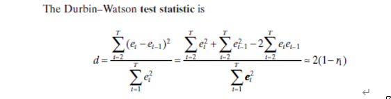

```{r setup, include=FALSE}
knitr::opts_chunk$set(echo = TRUE)
```

복습

- 회귀분석이란 변수들 간의 관계를 모델링하는 통계적 기법. 상관관계 기반의 모델링으로, 한 변수만을 고려하는 단순선형회귀부터 여러 X변수를 고려하는 다중선형회귀를 주로 다룸.
- 회귀계수의 추정은 최소제곱법을 통해 진행하나, 오차의 정규성 가정이 있는 경우 ML 방법과 동일한 결과 산출
- 다중회귀에서 F 검정은 회귀식 자체에 대한 검정을 다루고, t 검정은 다른 변수를 고정시킨 상태에서 개별 변수의 유의성을 검정
- 회귀식의 Goodness of fit을 측정하는 지표로는 $R^2$과 $R_a^2$가 있는데, 변수 개수가 늘어날 경우 $R_a^2$로 모델 간의 비교를 진행할 수 있음.
- 하지만 회귀분석은 이상치에 민감한 경향을 가지기 때문에, 이를 Outlier, Leverage, Influence Point를 통해 각각 관측치를 확인해야 함
- 오늘은 회귀분석의 가정들에 대해 확인하면서 모델의 가정이 깨졌을 때의 문제점들을 확인할 것이다.

# 회귀분석의 가정

## 모델의 가정이 지니는 의미

회귀분석은 가정이 매우 많은 모델이다. 모델의 선형성, 오차의 등분산성, 오차의 정규성, 오차의 독립성과 같이 이 4가지 가정이 지켜져야 한다. 이 가정들은 모델의 성능을 위해서도 중요하지만, 이런 가정들이 있기 때문에 적은 수의 관측치만으로도 모델을 구성할 수 있고, 적은 관측치로도 좋은 추정과 예측이 가능하다. 

회귀분석 이외의 머신러닝 모델들에도 가정들이 들어간다. 이런 가정들은 모델이 만들어진 형태와 관련있기 때문에 모델마다 다르지만, 이러한 가정들이 지켜지지 않을 경우 모델의 성능이 급락하는 경우가 많다. 회귀분석 가정의 진단과 처방하는 과정들을 통해 모델의 가정이 어떤 의미를 지니는지 근본있게 이해해보고, 다른 모델들을 쓸 때도 모델에 대한 근본있는 이해를 바탕으로 사용하는 사람들이 됩시다!

## 회귀분석의 가정들

이 수식을 통해 회귀분석의 기본 가정들을 알 수 있다.
$$
y_i=β_0+β_1 x_1+⋯+β_p x_p, \quad\quad ε \sim NID(0,σ^2)
$$
먼저 식 자체가 x변수들의 ‘선형결합’으로 이루어져 있다. 모델 자체가 선형성만 고려하고 있다는 의미!

오차의 경우 네 가지 가정을 가지고 있다. 먼저 오차는 정규분포(N)을 따르고, 오차들은 독립적(ID)이다. 그리고 오차의 평균은 0이고, 분산은 $σ^2$으로 동일하다. 하지만 여기서 ‘오차의 평균이 0’ 이라는 가정은 거의 위반되지 않는다고 이해하면 된다. 따라서 오차의 정규성, 독립성, 등분산성에 관심을 갖자!

## 모델의 선형성

반응변수 Y와 예측변수 X_1~X_p의 관계가 선형이다.

$$
\begin{aligned}
&y=β_0+β_1 x_1+ε \\
&y=β_0+β_1 logx_1+ε \\
&y=β_0+β_1 x_1+β_2 x_1^2+ε 
\end{aligned}
$$

$$
y=β_0 e^{β_1 x_1} \quad→ \quad y^*=logy=logβ_0+β_1 x_1=β_0^*+β_1 x_1
$$

변환된 x를 새로운 x로 취급한다면, 이 모든 결합들은 선형결합을 만족한다. 

또한 승법모형(곱) 또한 y에 log변환을 할 경우 가법모형으로 변환 가능하다. 

```{r, echo = FALSE, fig.cap = 'linearity', fig.align='center', out.width='100%'}

```

- $y=\frac{\beta_1x}{\beta_0+x}$ 와 같은 형태라면, 이는 변환을 통해 선형을 만들 수 없기 때문에 비선형모델이다. 

하지만 변수가 많을 때는, 고차원 상에서 선형성을 파악하는 것은 어렵다. 이를 위한 방법은 잠시 뒤에!

## 오차의 등분산성

오차의 분산은 $σ^2$로 동일하다. 이를 등분산(Homoskedasticity)라고 하고, 이 가정이 깨지면 이분산(Heteroskedasticity)라고 한다.

```{r, echo = FALSE, fig.cap = 'Heteroskedasticity', fig.align='center', out.width='70%'}

```

왜 등분산성을 만족해야 하는가?

- 이분산 형태라고 해서 회귀계수 추정에 편향(bias)가 생기지는 않는다. 하지만 회귀계수 추정의 효율성을 떨어뜨린다. 이렇게 분산이 일정하지 않고 변화한다면 전체적인 회귀계수의 분산도 커질 수밖에 없는데, 그 결과 최소제곱추정량은 과소추정된 등분산을 가지고 t-value나 F-value를 산출하게 된다. 이는 회귀식과 회귀계수 검정에 대한 신뢰성을 떨어뜨린다. 실제로는 유의하지 않은 변수가 유의하다고 나타날 수 있게 된다.
- 이를 가설검정의 관점에서 말하면, 충분히 유의할 수 있는 귀무가설을 기각하는 것이고, 제 1종 오류(Type 1 error)가 alpha = 0.05로 고정되지 못하고 더 상승하는 것이다.
- 최소제곱추정량이 더 이상 BLUE가 아니다. LSE의 가정 세가지를 만족하지 못하고 있으니!!

## 오차의 정규성

오차들은 정규분포를 따른다. 정규분포가 오차에 대한 확률분포이기 때문에, 우리의 회귀식이 데이터를 잘 표현하고 있다면, 오차들은 단순 잡음(Noise)가 되어 정규분포에 근접하는 형태가 나올 것이다. 

```{r, echo = FALSE, fig.cap = 'Normality of Error', fig.align='center', out.width='90%'}

```

왜 정규성을 만족해야 하는가?

-	오차의 정규성(분포)을 가정하기 때문에 우리가 회귀식과 개별회귀 계수에 대한 검정을 시행할 수 있다. 만약 정규분포를 따르지 않을 경우, 각각 가설검정에서 분포가 왜곡될 것이고, 이에 따라 검정 결과를 신뢰할 수 없다.
-	정규분포를 따르지 않는 경우, 예측력에 있어서도 성능이 좋지 않다. 

## 오차의 독립성

오차항은 서로 독립이다. 이를 위반하는 경우 자기상관성(Autocorrelation)이 있다고 말하고, 일종의 패턴을 지닌다고 이해하면 된다. 우리의 모델이 데이터를 잘 설명한다면, 설명하고 남은 잔차가 특정 패턴을 지니지 않는다. 그런데 시간적, 공간적으로 인접한 관측치들은 유사한 경향을 가지기 때문에 회귀식 만으로 설명되지 않는 패턴이 남아 있을 수 있다

왜 독립성을 만족해야 하는가?

-	최소제곱추정량이 더 이상 BLUE가 아니다. LSE의 가정 세가지를 만족하지 못하고 있으니!!
- $σ ̂^$2의 추정량과 회귀계수의 표준오차가 실제보다 심각하게 과소추정된다. 따라서 유의성 검정의 결과를 신뢰할 수 없고, Prediction Interval도 넓어지게 된다.

# 잔차 플랏(Residual Plots)

Graphical Analysis : R에서는 회귀식을 적합(fitting)할 경우, 자동적으로 네 가지 잔차 플랏을 첨부해준다. 이 잔차 플랏들을 통해 모델 가정들을 만족하고 있는지 간단한 확인이 가능하다.

```{r, eval=F}
fit1 = lm(delTime ~ distance, data = delivery)
plot(fit1)
```

## Residual VS Fitted

```{r, echo = FALSE, fig.cap = '', fig.align='center', out.width='60%'}

```

- X축 : fitted values($\hat{y}$ 예측값),  Y축 : residuals($y-\hat{y}$)
- 선형성과 등분산성, 독립성 확인가능
- 빨간선은 전체적인 잔차들의 추세선이다. 잔차들의 패턴을 부드럽게 이었다고 이해하자!

## Normal QQ-plot

```{r, echo = FALSE, fig.cap = '', fig.align='center', out.width='60%'}

```

-	X축 : Theoretical Quantile(정규분포 사분위수), Y축 : Standardized residual(표준화잔차)
-	정규성 확인 가능
-	Y=X에 가까울 수록, 잔차가 정규성을 만족한다는 뜻! 직선이라는 것은 정규분포 사분위수 위에 그대로 위치한다는 거니까!

## Scale-Location

```{r, echo = FALSE, fig.cap = '', fig.align='center', out.width='70%'}

```

- X축 : fitted values($\hat{y}$ 예측값),  Y축 : 표준화잔차
- 선형성과 등분산성, 독립성 확인가능. 보통 등분산성 고려
- 빨간선은 추세선

## Residuals VS Leverage

```{r, echo = FALSE, fig.cap = '', fig.align='center', out.width='70%'}

```

-	영향점을 파악하기 위한 plot. 넘어갑니다.

# 선형성 진단과 처방

## 진단 - 잔차플랏

다음과 같이 평균 0을 중심으로 하는 x축에 평행한 직선 형태가 아니라면 선형성이 위반되었다고 볼 수 있다.

- 선형성이 위배되는 보통의 경우, 이차함수 혹은 삼차함수 형태처럼 나타난다.

```{r, echo = FALSE, fig.cap = 'residual pattern', fig.align='center', out.width='80%'}
knitr::include_graphics('pic/K-083.png')
```

```{r, echo = FALSE, fig.cap = 'residual pattern2', fig.align='center', out.width='80%'}

```

## 진단 - crPlots

`Car` 패키지의 `crPlots` 함수를 통해 개별 변수의 선형성을 파악할 수 있다.

-	선형성을 만족하지 못할 때, 어떤 변수의 영향으로 인한 것인지 잔차 플랏만으로는 확인하기 어렵다. 따라서 개별 변수의 영향을 확인해야 한다.

```{r, echo = FALSE, fig.cap = 'crPlots', fig.align='center', out.width='80%'}

```

-	crPlots에서 시각화 해주는 것은 Partial Regression Plot이다. 개별 회귀계수 검정 때 다른 변수를 고정시킨 상태에서 해당 변수의 영향력을 본다고 했죠? 그것과 비슷한 아이디어다.
- Y축 : Partial residual ($y-β_i x_i$ 를 제외한 모든 회귀식 성분 ), X축 : $x_i$ 변수
- 파란 점선은 Partial residual과 x_i의 적합된 직선이고, 보라색 실선은 잔차의 추세선이다. 즉, 새로운 변수에 의해 선형적으로 설명되어야 하는 부분을 담고 있다고 느낌적으로 이해해보자. 오른쪽 그래프는 education 변수가 선형적으로 잘 설명하고 있지만, 왼쪽 그래프는 income이 선형적으로 설명함에 따라 log형태의 비선형성을 잘 잡아내지 못하고 있음을 확인 가능하다.

## 처방 : 변수 변환

비선형 관계를 변수 변환을 통해 해결할 수 있다.

```{r, echo = FALSE, fig.cap = 'transformation for nonlinear', fig.align='center', out.width='70%'}

```

$$
\vspace{7\baselineskip}
$$

```{r, echo = FALSE, fig.cap = 'transformation for nonlinear2', fig.align='center', out.width='80%'}

```

## 처방 : Polynomial Regression

고차항을 고려하는 Polynomial regression을 통해 해결 가능하다. 잔차 플랏이나 Partial regression plot을 봤을 때, 이차 이상의 곡선 형태가 나타날 경우 사용가능하다. 삼차를 넘어서는 모델링은 거의 하지 않는다. 다음은 삼차까지만 고려하는 이유를 보여주는 극단적인 예시다. 초고차항을 적합해도 경향을 못잡아낸다는 것!

```{r, echo = FALSE, fig.cap = 'polymonial fitting for Transcendental function', fig.align='center', out.width='80%'}

```

예를 들어, 잔차 플랏과 Partial regression plot에서 이차 곡선 형태가 나타날 경우, 해당 변수에 대해 이차항까지 적합하면 된다. 

$$
\vspace{7\baselineskip}
$$

```{r, echo = FALSE, fig.cap = 'polymonial fitting', fig.align='center', out.width='70%'}

```

# 등분산성 진단과 처방

## 진단 - 잔차플랏

등분산성은 잔차 플랏 중 ‘residual vs fitted’와 ‘scale – location’ 플랏에서 확인할 수 있다.

```{r, echo = FALSE, fig.cap = 'Heteroskedasticity2', fig.align='center', out.width='70%'}

```

이를 단순선형회귀의 산점도에서도 간단하게 확인해 볼 수 있는데, 이런 형태다.

```{r, echo = FALSE, fig.cap = 'Heteroskedasticity3', fig.align='center', out.width='70%'}

```

이렇듯 퍼짐의 정도가 일정하지 않고, 퍼짐이 증가하거나 감소하거나, 혹은 x 평균 부분의 퍼짐이 큰 형태 등 이분산의 형태는 다양하다.

이처럼 그래프 상으로 명확하게 나타나는 이분산 형태도 있지만, 육안으로 판단하기 어려울 수 있다. 이를 위한 테스트 방법들을 알아보자.

## 진단 - Test

가설

- $H_0$ : 주어진 데이터는 등분산성을 지닌다.
- $H_1$ : 주어진 데이터는 등분산성을 지니지 않는다.

### BP(Breusch-Pagan) test

-	분산이 예측(predictor)변수에 대한 선형결합으로 되어있다는 가정을 바탕으로 한다. 분산과 설명변수 간에 세운 회귀식의 결정계수 값이 높으면 등분산이 아니게 된다.

-	단점은 분산과 X변수가 선형결합으로 이뤄졌다는 가정을 바탕으로 하기 때문에, 비선형결합으로 만들어지는 이분산성을 잡아낼 수 없다.

-	R에서는 lmstat 패키지의 bptest 함수에 적합된 회귀식을 넣으면 된다. 이는 LRT 기반으로 추정한다.

```{r, echo = FALSE, fig.cap = 'BP test', fig.align='center', out.width='60%'}
knitr::include_graphics('pic/K-092.png')
```

-	혹은 car 패키지의 ‘ncvTest’를 사용하면 된다. 사용방법은 동일하다. 

## 처방 - WLS(Weighted Least Square)

우리 데이터에서 이분산성이 관측되었다면 어떤 처방을 해야할까? 예를 들어 분산이 점점 커지고 있다면, 커지는 분산을 고려한 모델링이 가능하지 않을까? 이렇듯 등분산이 아닌 형태에 데이터마다 다른 가중치를 주어서 등분산을 만족하게 해주는 ‘일반화된 최소제곱법 (Generalized Least Square)’의 한 형태가 WLS이다. 분산이 큰 부분의 관측치에는 가중치를 적게 주니, 전체적인 분산을 비슷하게 맞춰주는 방식이다.
$$
∑w_i(y_i-β_0-β_1 x_i1-…-β_p x_ip)^2, \quad\quad w_i∝ \frac{1}{\sigma_i^2}
$$

- 이렇듯 가중치는 분산의 역수로 넣어주지만, 분산을 우리가 알기 어렵기 때문에 경험적으로 선정해야 한다. 사전 지식을 통해 정하거나, 아니면 잔차 플랏을 보고 선정해야 한다는 뜻!

```{r, echo = FALSE, fig.cap = 'increasing variance', fig.align='center', out.width='60%'}

```

- 이렇게 residual plot에서 분산이 점점 커질 경우에는, $w_i∝ \frac{1}{x_i^2}$와 같은 방식으로!=
-	이런 WLS의 장점은, WLS을 통해 구한 추정량은 다시 또 BLUE라는 점!

## 처방 – Box-Cox Transformations

박스칵스 변환은 y를 변환함으로써 등분산 혹은 정규성을 해결해주는 방법이다. 이때 y를 우리가 자의적으로 변환하는 것이 아니라, 통계적인 검정에 따라 구한다는 점에서 효율적이다.

$$
y^{(\lambda)}=
\begin{cases}
\frac{y^{\lambda}-1}{\lambda}, \quad if \: \lambda \neq0 \\
\log y, \quad if \: \lambda=0
\end{cases}
$$

다음과 같은 변환을 통해 등분산 혹은 정규성을 해결해주는데, λ(람다)는 ML방법을 통해 구한다. R을 믿어보자!

-	또한 car 패키지의 powerTransform 함수도 동일한 기능을 제공한다. 

$$
\vspace{5\baselineskip}
$$

```{r, echo = FALSE, fig.cap = 'boxcox', fig.align='center', out.width='60%'}

```

박스콕스 변환을 할 경우, 등분산을 고치기 위해 했는데 정규성까지 보정되기도 한다. 

# 정규성 진단과 처방

## 진단 - Normal QQ plot

```{r, echo = FALSE, fig.cap = 'boxcox', fig.align='center', out.width='60%'}

```

적합된 회귀식을 plot으로 그렸을 때 두번째로 나오는 그래프. 점들이 y=x에 가까우면 정규성을 만족한다. 각각이 어떤 형태인지 외울 필요는 없다.

하지만 이런 QQplot으로 확인하는 경우에는 판단이 주관적일 수밖에 없다. 너무 명확한 경우를 빼고는 test를 통해 확인하는 것이 더 객관적이다.

## 진단 - Test

가설 

- $H_0$ : 주어진 데이터는 정규분포를 따른다.
- $H_1$ : 주어진 데이터는 정규분포를 따르지 않는다.
- 우리가 원하는 것은 귀무가설을 기각하지 못하는 것!

### Shapiro Wilk test

-	QQ플랏의 아이디어처럼, 정규분포7분위수 값과 표준화 잔차 사이의 선형관계를 확인하는 검정이다.
-	관측치가 5000개 이하일 때만 가능하다.
-	R 기본함수로 내장되어 있으며, residual 값을 넣으면 된다.

```{r, echo = FALSE, fig.cap = 'shapiro wilk test', fig.align='center', out.width='80%'}

```

## 처방 - Box-Cox Transformation

아까 등분산성에서 언급했듯이, 정규성을 해결하기 위해서도 사용한다. '정규성을 먼저 수정해주는 경우가 많다.'

# 독립성 진단과 처방

## 진단 - Test

가설

- $H_0$ : 잔차들이 서로 독립적이다.(자기상관성이 없다.)
- $H_1$ : 잔차들이 서로 독립이 아니다.(자기상관성이 있다.)

### Durbin-Watson Test

바로 앞 뒤 관측치의 자기상관성을 확인하는 테스트다. 더빈왓슨 통계량은 0부터 4까지의 값을 가질 수 있으며, 0에 가까울수록 양의 상관관계를, 4에 가까울수록 음의 상관관계를 나타낸다. 2에 가까운 값이어야 귀무가설을 기각하지 못한다.

$$
d = \frac{\sum_{t=2}^T (e_t-e_{t-1})^2}{\sum_{t=1}^Te_i^2}
$$

```{r, echo = FALSE, fig.cap = 'Durbin-Watson Test', fig.align='center', out.width='80%'}

```

-	car 패키지의 durbinWatsonTest 함수를 사용할 수 있다.
-	하지만 이는 첫번째 순서의 자기상관성만 본다는 단점이 있다.

## 처방

시계열 분석으로 넘어가기

-	다른 보정도 가능하지만, 가능하면 시계열 모델링을 하는 것이 더 적절하다. 기본적으로 회귀모형같이 정적인 모델로는 동적인 움직임을 잡아내는 것에 한계가 있을 수 있으니 시계열 모델링으로 넘어가자.

## gvlma package

선형성, 정규성, 등분산성 한번에 체크해주는 함수! (Global Validation of Linear Model Assumption)

1.	Global Stat - Are the relationships between your X predictors and Y roughly linear? Rejection of the null (p < .05) indicates a non-linear relationship between one or more of your X’s and Y.

2.	Skewness - Is your distribution skewed positively or negatively, necessitating a transformation to meet the assumption of normality? Rejection of the null (p < .05) indicates that you should likely transform your data.

3.	Kurtosis- Is your distribution kurtotic (highly peaked or very shallowly peaked), necessitating a transformation to meet the assumption of normality? Rejection of the null (p < .05) indicates that you should likely transform your data.

4.	Link Function- Is your dependent variable truly continuous, or categorical? Rejection of the null (p < .05) indicates that you should use an alternative form of the generalized linear model (e.g. logistic or binomial regression).

5.	Heteroscedasticity- Is the variance of your model residuals constant across the range of X (assumption of homoscedasticity)? Rejection of the null (p < .05) indicates that your residuals are heteroscedastic, and thus non-constant across the range of X. Your model is better/worse at predicting for certain ranges of your X scales.

