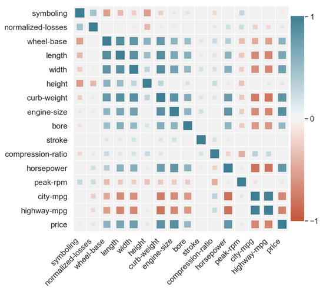
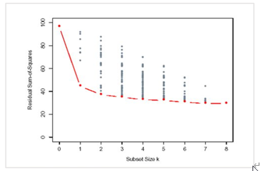
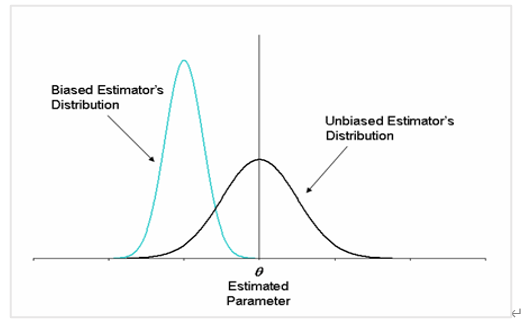
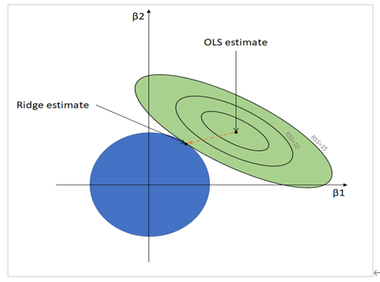
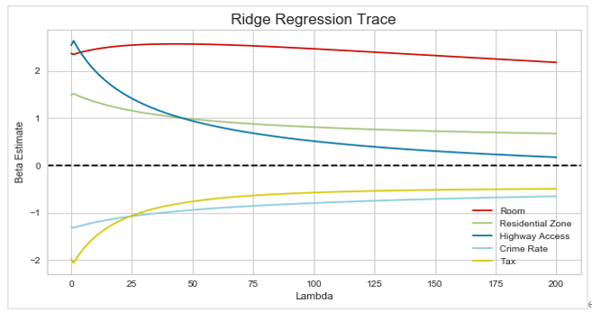
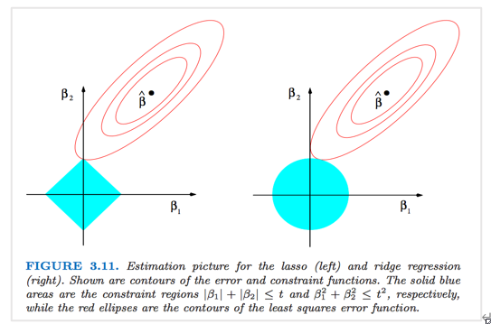
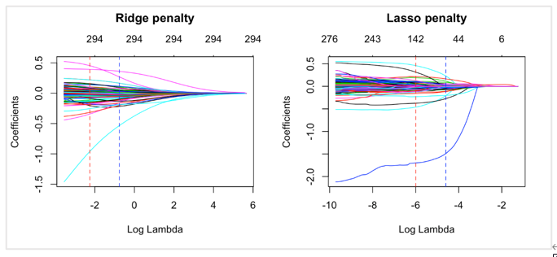
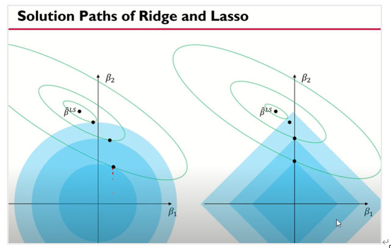

```{r setup, include=FALSE}
knitr::opts_chunk$set(echo = TRUE)
```

회귀분석의 가정은 모델의 선형성, 오차의 등분산성, 정규성, 독립성 네 가지이다.

-	가정의 확인은 잔차 플랏으로 확인할 수 있지만, Test를 통해 더 객관적인 기준을 더할 수 있다.
-	모델의 선형성이 깨지면 모델을 과소추정 (underestimate) 했다는 뜻이고, 고차항을 추가할 수 있다.
-	오차의 등분산성, 독립성이 깨지면 LSE가 최소분산을 갖지 않게되고, 검정결과를 신뢰할 수 없게 된다. 이를 해결하기 위해서는 등분산은 WLS, 독립성은 시계열 모델링을 고려하게 된다.
-	오차의 정규성이 깨질 경우 예측 성능에 큰 문제가 생긴다. 이를 해결하기 위해 Y변수에 대한 변환을 시행한다.
-	회귀분석의 가정은 꼭 지켜져야 하지만, 데이터가 충분히 많을 경우, 가정 위배에 따른 모델의 분산 증가를 완화할 수 있다.

# 다중공선성

## 회귀가정만 만족하면 되는가?

지금까지 회귀가정들 선형성, 등분산성, 정규성, 독립성에 대해 알아보았다. 이 가정들은 분명히 지켜져야 하는 것은 맞으나, 데이터가 충분히 많을 경우, 회귀가정이 조금 위배됨으로써 증가하는 모델의 분산을 완화시켜줄 수 있다고 알려져 있다. 

하지만 지금부터 알아볼 다중공선성은 더 심각한 문제고, 회귀분석 자체를 위태롭게 한다. 지금까지 연구되어온 선형모형들은 다중공선성을 해결하기 위한 모형들이 많았고, 우리가 데이터 분석에 많이 쓰는 선형 모형은 모두 다중공선성을 해결해주는 모형들이다.

## 다중공선성이란?

### 불안정한 회귀추정

다중공선성은 예측변수 X들 간의 선형관계가 있는 경우를 말한다. X 변수들간의 선형적 관계가 없을 경우 이를 Uncorrelated라고 한다. 우리가 개별 변수의 효과를 해석할 때, ‘다른 변수를 고정한 상태에서 해당 X의 증분’을 정의했다. 만약 변수들 간의 Uncorrelated 가정이 깨지지 않으면, 정말 해석하기 편한 모형일 것이다. 하지만 현실의 변수들은 Correlated되어 있는 경우가 많다. 실제 선형관계가 있던지, 아니면 관측값에 현실적인 noise가 있을 것이다. 따라서 완전히 uncorrelated 일수는 없지만, 변수들간의 상관관계가 크지 않기를 바란다.

근데 우리에게 중간고사 시험 성적 X1과 기말고사 시험성적 X2가 있고, 학점 Y가 있다. 이 학점 Y를 잘 예측해보겠다고 전체 시험성적 평균 X3 = (X1 + X2)/2을 구했고, X1~X3을 이용해 회귀분석을 시행했다. 무슨 문제가 발생할까? X3은 X1과 X2로 인해 완벽하게 설명된다. 완전히 필요없는 변수인 것! 이를 행렬의 관점에서 보게되면, $X^tX$가 Full rank가 아니게 된다. 따라서 $X^t X$의 역행렬도 존재하지 않는다. 따라서 유니크한 베타추정량을 구할 수 없고, 선형회귀분석이 불가능해진다. ($X^t X$의 역행렬이 존재하지 않는다는 것은 $Det(X)=0$이기 때문)

그렇다면 저렇게 silly한 변수를 잡지 않으면 되지 않을까? 하지만 저런 Complete Multico-linearity(Perfectly Linear Dependence)보다 조금은 현실적인 Multicolinearity(Near-Linear Dependence)한 상황은 너무 많다. 우리가 가진 변수가 많으면 많을수록, 저절로 서로 연관성이 있는 변수들이 섞일 수 밖에 없다. 이를 수식으로 이해하면, $Det(X^tX) \neq 0,\quad but \:\: Det(X^tX) \approx 0$인 상황이다.

$$
\hat{\beta} =(X^t X)^{-1} X^t y, \quad Var(\hat{\beta})=σ^2 (X^t X)^{-1}, \quad (X^t X)^{-1}= \frac{1}{Det(X^tX)} adj(X^tX)
$$

즉, $Det(X^tX) \approx 0$이 됨에 따라, 회귀계수 추정이 매우 불안정해진다.

### 다중공선성이 문제가 되는 이유

회귀계수들의 분산이 커짐에 따라, 개별 변수의 검정에서 t 검정 통계량이 작아지게 되고, beta = 0 이라는 귀무가설을 기각하지 못하는 경우가 많아진다. 이를 회귀식 전체에서 보게 되면, 전체 회귀식은 유의한데, 개별 회귀계수 중에는 유의한 것이 없는 말도 안되는 결과가 발생한다. 이게 왜 말이 안되는지 1주차에 간단히 설명했죠? F가 더 엄격한 검정인데, t 검정에서 기각을 못하고 있는 것…!

이러한 결과가 나타나게 되는 이유를 해석해보면, 현재 Near-Linear Dependency가 발생하고 있으면, 해당 변수 Xj는 이미 고정된 다른 변수 Xk에 의해 설명되고 있는 상황이다. 다른 변수를 고정시키고 Xj의 효과를 봐야 하는데, Xj가 움직임에 따라 Xk도 움직인다. Xk가 Xj몫까지 설명을 해버리게 되는 상황이고, 그에 따라 개별 회귀계수는 유의하지 않게 된다.

회귀계수들의 분산이 높다는 것은 모델이 불안정하다는 것을 의미하고, 그에 따라 Prediction Accuracy도 심각하게 감소한다!

## 다중공선성의 판별

### 느낌으로 판별하기

-	F검정에서는 유의했으나 개별 회귀계수들에 대한 검정에서 귀무가설을 대부분 기각하지 못할 때
-	상식적으로 유의한 회귀계수가 유의하지 않다고 나올 경우. 다른 변수가 이미 설명하고 있기 때문이다.
-	회귀계수의 부호가 상식과 다를 경우. 다른 변수가 이미 설명하고 있어서 반대로 가는 경우가 발생

### 상관계수 플랏

```{r, echo = FALSE, fig.cap = 'Correlation plot', fig.align='center', out.width='70%'}

```

-	상관계수 플랏을 통해 어떤 변수들 사이의 선형관계가 있는지 확인할 수 있다. 보통 절대값 기준으로 상관계수가 0.7 이상인 변수들이 많을 경우, 다중공선성을 의심할 수 있다.

추가적으로 다중공선성을 확인하는 지표로서 VIF(Variation Inflation Factor, 분산팽창인자)가 존재하지만, 설명하지 않는다.

## 다중공선성의 해결

다중공선성을 해결하기 위한 회귀분석의 접근은 세가지가 존재한다. 

1) 변수선택볍 (Variable Selection)
1) 차원축소 (Dimension Reduction)
1) 축소추정/정규화(Shrinkage/Regularization)

이 방법중에서 우리는 변수선택법과 정규화 방법에 대해 다루려 한다. 차원축소 같은 경우 선형대수학적 지식이 많이 요구되다보니, 생략하도록 한다.

# 변수선택법 (Variable Selection)

## 변수선택의 개념

우리에게 주어져 있는 가능한 후보 변수(Candidate Regressor)들은 많고, 그에 따라 후보 변수들의 조합도 매우 많다. 하지만 이 중에 일부분만 중요하거나 예측에 유의미할 수 있다. 따라서 우리는 후보 변수들의 적절한 부분집합을 찾으려고 한다. 변수선택법은 다중공선성이 존재할 때 많이 사용된다. 물론 변수선택법이 다중공선성의 완벽한 제거를 보장하는 것은 아니지만, 

1)높은 상관관계를 가지는 변수들 중 일부만을 선택하도록 해주고, 
2)높은 상관관계를 가지는 변수들의 존재를 정당화해줄 수 있다.

우리가 모델을 만들 때, 두 목적은 충돌한다. 먼저 우리는 최대한 많은 변수들을 사용해서 $y$를 예측하기 위한 많은 정보를 포함하고 싶기도 하지만, 최대한 적은 변수들을 사용해서 모형을 단순화하고 싶어한다. 이 두 trade-off를 잘 고려해서 ‘최적의 회귀식 (Best Regression Equation)’을 찾는 방법이 변수선택법이고, 이렇게 구해진 회귀식이 언제나 최적의 회귀식이라는 보장은 할 수 없지만, 우리의 결론을 뒷받침하는 좋은 근거가 된다.

## 변수선택의 기준

결정계수 $R^2$은 변수개수가 증가함에 따라 자동적으로 증가하는 성질이 있기 때문에 좋은 평가기준이 될 수 없다. 수정결정계수 $R_{adj}^2$도 변수선택의 기준이 될 수 있지만, 이것보다는 다른 방법을 많이 쓴다. 

변수선택법의 핵심은 최대한 적은 변수안에서 데이터를 제일 잘 설명해야 한다는 것이다. 변수가 너무 적으면 간결하고 해석이 쉬워지더라도 예측력은 떨어질 것이고, 변수가 너무 많으면 무의미한 변수들이 포함될 가능성이 높다. 이 trade-off를 고려한 기준을 만들어야 한다.

-	당장의 SSE/RSS (Residual Sum of Square)를 충분히 작게 함과 동시에, 변수의 개수에 대한 penalty를 부여해 변수를 줄이는 방식이 제일 직관적으로 간단해보인다! 여러 기준이 있지만 AIC와 BIC만 보겠다.

### AIC (Akaike Information Criterion)

$$
\begin{aligned}
AIC=-2log(liklihood)+&2p,\quad\quad \:p\: :\text{변수개수} \\
AIC_p=& n \ln(\frac{SSE_p}{n})+2p
\end{aligned}
$$

앞부분은 얼마나 주어진 데이터를 잘 설명하는지(Goodness of fit)이고, 뒷부분은 Penalty이다. 이 둘의 합을 동시에 작게 하기 때문에 적절한 복잡도를 가진 변수 조합이 만들어질 것이다. AIC는 낮으면 낮을수록 더 좋은 모형이다.

### BIC (Bayesian Information Criterion)

$$
\begin{aligned}
BIC=-2log(liklihood)+&p \ln n,\quad\quad \:p\: :\text{변수개수} \\
BIC_p=& n \ln(\frac{SSE_p}{n})+p \ln n
\end{aligned}
$$

AIC보다 변수 개수에 더 큰 페널티를 부여하는 방식. 당장 $N>8$이면 BIC는 AIC보다 더 큰 페널티를 지닌다. AIC보다 변수 개수가 훨씬 작은 모델을 선호하는 경향이 있다. BIC도 작으면 작을수록 더 좋은 모형이다.

두 지표는 상황에 따라 다른 결과를 반환하기 때문에, 결과를 보고 우리가 합리적으로 판단하는 것이 중요하다.

## 변수선택의 방법

### Best Subset Selection (All Possible Regression)

```{r, echo = FALSE, fig.cap = 'Best Subset Selection', fig.align='center', out.width='70%'}

```

가능한 모든 변수들의 조합을 다 고려한다. 변수의 개수가 $p$개라면, $2^p$ 개의 모형을 모두 적합하고 비교해야 한다. 모든 조합을 다 고려해서 결과를 내기 때문에 Best Model에 대한 더 신뢰할 수 있는 결과를 산출한다. 다만 $p > 40$인 경우 계산이 불가능하며, 적당한 $p$에서도 많은 관측치를 지니고 있다면 모든 모델을 고려한 계산 비용이 많이 걸린다. 자동적으로 모델을 찾아주는 것이 아니라, 모든 가능성을 직접 찾기 때문! 직접 계산을 해야하다보니 계산비용이 엄청나다.

Best Subset Selection의 알고리즘은 다음과 같다. $M_1$부터 $M_p$까지를 구하는데, 여기서 $M_k$  $(k=1,…,p)$란 변수의 개수를 $k$개로 적합했을 때 적합한 회귀식 중 RSS(MSE)가 제일 작은 식이다. 변수의 개수가 같은 선에서 먼저 모델을 고르고, 변수의 개수가 다른 경우에는 $AIC$ 혹은 $BIC$로 골라서 최적의 회귀식을 찾는 것이다. 직접 쓰면서 설명해볼게요.

$$
\vspace{10\baselineskip}
$$

### 전진선택법 (Forward Selection)

Null model : $y= β_0$,  $\hat{\beta}=\bar{y}$ 에서 시작해서 변수를 하나씩 추가해가는 과정. Null model에서 $x_1, \cdots, x_p$ 중 어떤 것을 추가했을 때 AIC와 BIC가 가장 낮은지를 판단한다.

이후 만약 $x_2$가 추가되었다면, $x_2$를 제외한 나머지를 추가해보면서 AIC와 BIC가 가장 낮은 변수를 추가하는 과정을 반복한다. 모든 과정을 마쳤을 때, AIC와 BIC가 가장 낮은 모델을 선정한다.

다만 변수를 추가하는 과정에서 모든 조합을 고려하지 않기 때문에 Best Model이라고 말할 수는 없다. 계산량이 비교적 적게 들기 때문에 선호되는 방법이다.

$$
\vspace{10\baselineskip}
$$

### 후진제거법 (Backward Elimination)

Full model : $y=β_0+β_1 x_1+β_2 x_2+⋯+β_p x_p$ 에서 시작해서 변수를 하나씩 제거해가는 과정. Full model에서 어느 변수를 뺄 때, AIC와 BIC가 제일 낮은지를 판단하고, 이 과정을 이어나간다. 모든 과정을 마쳤을 때, AIC와 BIC가 가장 낮은 모델을 선정한다.

Forward Selection보다 더 좋은 결과를 도출한다고 알려져 있지만, Best subset selection 방법과 마찬가지로 $p > 40$인 경우에는 적용할 수 없다. 또한 모든 조합을 고려하지 않기 때문에 Best Model이라고 말할 수 없다.

$$
\vspace{10\baselineskip}
$$

### 단계적 선택법 (Stepwise Selection)

Forward Selection과 Backward Elimination 과정을 섞었다. Null model에서 시작할 수도 있고, Full model에서 시작할 수도 있다. 변수를 선택하거나 제거하는 모든 경우를 포함했을 때, AIC와 BIC가 감소하는 방향으로 움직인다.

변수를 선택할 수도, 제거할 수도 있기 때문에 더 유연하게 움직이지만, 당연히 모든 조합을 고려할 수 없기 때문에 Best model이라고 말할 수 없다.

# 정규화 (Regularization)

## Shrinkage Method

```{r, echo = FALSE, fig.cap = 'Shrinkage Method', fig.align='center', out.width='80%'}

```

Shrinkage Method(축소추정)는 정규화의 다른 이름이다. 둘의 이름을 이해하는 것은 해당 방법을 이해하는 데에 큰 도움이 된다. 축소추정이란 각각 개별 베타추정량을 0으로 수축시키는 방법이다. 정규화는 각각의 베타값의 크기에 제약을 두어서, 일정 수준 이상으로 커지지 않게 하는 것이다. 다중공선성이 존재할 경우, 각각 개별 베타계수의 분산이 매우 크게 상승한다. 기존의 LSE 방법은 BLUE라는 점에서 이론적으로 매우 좋은 통계량이지만, 다중공선성이 존재할 경우, 분산이 지나치게 큰 통계량이다. 그렇다면 우리 추정량의 일부 편향(Bias)을 허용하되, 전체 분산을 줄일 수 있다면? 불편성을 포기하고, 전체 MSE (Bias^2 + Variance)를 더 작게하는 추정량을 얻어보자.

최소제곱 형태의 기존 목적함수에, 베타의 크기에 대한 제약을 두는 방식으로 진행한다. 원래 최소제곱 방법에서는 베타 크기에 제약이 없었고, 그에 따라 커지는 정도에 제한이 없었다. 그에 따라 베타는 BLUE가 될 수 있었는데, 베타 크기에 제약을 둠으로써 베타를 다소 과소추정하더라도 전체적인 MSE를 줄이는 방식이다. 

## Ridge Regression (능형회귀)

### 기본 수식

Ridge 회귀의 수식은 다음과 같다.

$$
\hat{\beta}^{ridge} = min_{\beta} \:\: \sum_{i=1}^{n} (y_i - \beta_0 - \sum_{j=1}^p \beta_j x_{ij})^2, \quad\quad \text{subject to} \: 
\sum_{j=1}^p \beta_j^2 \leq s
$$

이에 대해서 $\beta_1, \beta_2$만 있는 상황에 대해서 시각화를 해본다면, 

```{r, echo = FALSE, fig.cap = 'Ridge visualization', fig.align='center', out.width='70%'}

```

파란 범위가 릿지의 제약식 부분이다. 고등학교 수학 감성으로 이해해보면, $x^2+y^2≤r^2$ 인 원 내부에 해가 있어야 한다는 제약이다. 따라서 우리 목적함수의 해는 저 파란 부분 안에 존재해야 한다. 따라서 기존의 LSE 추정량이 타원의 중심이라면, 이를 원과 타원의 접점으로 이동시킨다. 그에 따라 최소제곱 추정량보다 목적함수의 결과값은 커질 수 있지만, 베타 값에 대한 제약 때문에 베타값이 커지는 것을 막는다. 릿지 추정량이 기존 LSE의 $\beta_1, \beta_2$보다 작음을 확인할 수 있다. 

제약식(원)의 범위를 정하는 s값은 tuning parameter로, 우리가 미리 설정하는 값이다. s값이 클수록 제약범위가 넓고, 제약범위가 충분히 넓다는 것은 제약이 없는 것과 마찬가지이다. 따라서 s가 무한히 클 경우, 릿지 추정량은 LSE와 동일하다. 반대로 s값이 작으면 작을수록 우리 제약범위가 0과 가까이 위치하게 된다. 그 결과 릿지 추정량은 0과 매우 가까운 값을 갖는다. 하지만 그림에서 보면 알 수 있듯이, 정확히 0을 찍지는 못한다!

이를 MSE의 관점에서 바라보자. s가 커지는 것은 LSE와 비슷한 추정을 하기 때문에 Low bias, High variance의 형태이고, s가 작아지는 것은 High bias, Low variance의 형태이다. 따라서 MSE가 최소가 되는 적절한 람다를 찾는 것이 중요하다. 현재 수식에서는 제약식이 존재하기 때문에, s를 고려한 최적화가 어렵다. 이를 변형시켜주자.

### 변형문제

원래 수식을 라그랑주 승수법을 통해 다음과 같이 변형시킬 수 있다. 그냥 받아들이자!

$$
\hat{\beta}^{ridge} = min_{\beta} \:\: \sum_{i=1}^{n} (y_i - \beta_0 - \sum_{j=1}^p \beta_j x_{ij})^2 + \lambda \: 
\sum_{j=1}^p \beta_j^2, \quad\quad \lambda \geq 0
$$

이에 대해 이해해보자. 해당 식은 기존의 최소제곱 목적함수도 최소화하면서, 개별 베타 제곱합도 동시에 작게 만든다. 원래 베타가 마음껏 팽창할 수 있을 때, 최소제곱이 목적함수가 최소화되었다. 그런데 베타에 대한 페널티가 주어지면서, 베타가 마음껏 팽창하면 해당 식은 최소화될 수 없다. 따라서 베타가 기존 LSE보다 작아지게 된다.

아까는 원의 제약범위 s가 tuning parameter였다면, 여기서는 λ(람다)가 tuning parameter가 된다. 만약 람다가 0이라고 하면, 이는 기존의 최소제곱 형태와 완전히 동일하다. 반면 람다가 매우 커진다고 생각하면, 전체 목적함수를 작게 만들기 위해서는 전체 식의 앞부분 (최소제곱)보다는 뒷부분 (페널티)에 영향을 많이 받을 것이다. 그 결과 람다가 커지면 beta값이 매우 작아져서 0과 가까운 값이 나올 것이다. 하지만 아까도 말했듯, 정확히 0을 찍지는 못하고, 0에 근접한 값이 나온다. 다음은 람다값을 변화시킴에 따른 베타값 변화의 시각화이다.

```{r, echo = FALSE, fig.cap = 'Ridge solution path', fig.align='center', out.width='80%'}

```

이를 MSE 관점에서 이해해보자. 람다가 작아지면 LSE와 비슷하면서 Low bias, High Variance한 형태이다. 람다가 커지면 High bias, Low variance의 형태이다. 따라서 MSE가 최소가 되는 적절한 람다를 찾는 것이 중요하다. 

### Property of ridge

릿지 추정량은 개별 베타값을 0에 가깝게 만들지만, 정확히 0으로 만들지는 않는다. 다중공선성을 해결해 좋은 예측을 가능하게 하지만, 변수 선택을 통한 해석력을 증가시켜 주진 못한다. 진짜 안중요한 베타가 있을 수도 있는데, 이거를 0에 가깝게 수축시키더라도 결국에는 0이 아니다. 따라서 분석가는 해당 변수를 자의적으로 제외하는 것에 고민과 한계를 가질 수밖에 없다.

### 람다 정하기

각각 개별 변수들의 단위에 따라서 수축되는 속도가 달라진다. 따라서 먼저 개별 변수들을 스케일링해서 단위를 맞춰주어야 한다. 그런 통계기반의 모델에서는 보통 표준화를 해준다.

개별 변수들의 단위를 맞춰주었다면, 이제 람다를 지정해주어야 한다. 이런 람다는 보통 Cross-Validation 과정을 거쳐서 구하는데, 우리 내용에서 CV를 다루지 않았다. 일단 MSE가 가장 낮은 람다를 선택한다고 생각하자.

## Lasso Regression

### 기본수식

릿지는 다중공선성을 해결해주면서 예측성능까지 매우 좋다. 하지만 베타 계수가 0에 가까워지더라도 정확히 0이 되지는 않기 때문에, 변수 선택의 기능이 없다. 그렇다면 변수선택을 하는 shrinkage method는 없을까? 제약식을 조금만 조정해보면 변수선택이 가능해질 수 있으니까!

$$
\hat{\beta}^{lasso} = min_{\beta} \:\: \sum_{i=1}^{n} (y_i - \beta_0 - \sum_{j=1}^p \beta_j x_{ij})^2, \quad\quad \text{subject to} \: 
\sum_{j=1}^p |\beta_j| \leq s
$$

이에 대해서 $\beta_1, \beta_2$만 있는 상황에 대해서 시각화를 해본다면, 

```{r, echo = FALSE, fig.cap = 'Lasso visualization', fig.align='center', out.width='70%'}

```

아까 릿지와 거의 유사한 형태임을 이해할 수 있다. 다만 제약식의 형태가 릿지에서는 원과 같았다면, 라쏘에서는 마름모와 같아진다. 아까 릿지처럼 하나하나 짚어보자. 고등학교 수학 감성으로 이해하면, $|x|+|y|≤r$인 마름모 내부에 해가 있어야 한다는 제약이다. 따라서 우리 목적함수의 해는 색칠된 부분 내부에 존재해야 한다. 기존 LSE가 타원의 중심에 있었다면, 라쏘는 이를 마름모와 타원의 접점 위로 위치시킨다. 그에 따라 라쏘 추정량의 베타가 기존 LSE의 베타보다 작음을 확인할 수 있다.

제약식 (마름모)의 범위를 정하는 s값은 tuning parameter로, 우리가 미리 설정하는 값이다. s값이 클수록 제약범위가 넓고, 제약범위가 넓다는 뜻은 제약이 약하다는 것과 같다. 따라서 s가 무한히 클 경우, 릿지 추정량은 LSE와 동일하다. 반대로 s값이 작으면 작을수록 우리의 제약범위가 0과 가까이 위치하게 된다. 그 결과 라쏘 추정량 중 일부의 베타는 0을 해로 갖게 된다. 아까 릿지는 정확히 0을 찍지 못했지만, 라쏘는 정확히 0을 찍어버린다!!

이를 MSE 관점에서 이해해보자. s가 커지는 것은 LSE와 비슷한 추정을 하기 때문에 Low bias, High variance의 형태이고, s가 작아지는 것은 High bias, Low variance의 형태이다. 따라서 MSE가 최소가 되는 적절한 람다를 찾는 것이 중요하다. 현재 수식에서는 제약식이 존재하기 때문에, s를 고려한 최적화가 어렵다. 이를 변형시켜주자.

### 변형문제

원래 수식을 라그랑주 승수법을 통해 다음과 같이 변형시킬 수 있다. 그냥 받아들이자!

$$
\hat{\beta}^{lasso} = min_{\beta} \:\: \sum_{i=1}^{n} (y_i - \beta_0 - \sum_{j=1}^p \beta_j x_{ij})^2 + \lambda \: 
\sum_{j=1}^p |\beta_j|, \quad\quad \lambda \geq 0
$$

이에 대해 이해해보자. 해당 식은 기존의 최소제곱 목적함수도 최소화하면서, 개별 베타 절대갑의 합도 동시에 작게 만든다. 원래 베타가 마음껏 팽창할 수 있을 때, 최소제곱이 목적함수가 최소화되었다. 그런데 베타에 대한 페널티가 주어지면서, 베타가 마음껏 팽창하면 해당 식은 최소화될 수 없다. 따라서 베타가 기존 LSE보다 작아지게 된다.

아까는 원의 제약범위 $s$가 tuning parameter였다면, 여기서는 $λ$(람다)가 tuning parameter가 된다. 만약 람다가 0이라고 하면, 이는 기존의 최소제곱 형태와 완전히 동일하다. 반면 람다가 매우 커진다고 생각하면, 전체 목적함수를 작게 만들기 위해서는 전체 식의 앞부분 (최소제곱)보다는 뒷부분 (페널티)에 영향을 많이 받을 것이다. 그 결과 람다가 커지면 $\beta$값이 매우 작아져서 결국 0이 되는 베타들이 생길 것이다. 릿지 추정량은 정확히 0이 나오지 않았지만, 라쏘는 정확히 0의 베타값을 반환함으로써 변수를 자연스럽게 선택해준다! 다음은 라쏘에서 람다 값이 점점 커짐에 따라 개별 베타계수가 0으로 수렴하는 것을 릿지와 비교한 시각화이다. 람다 값이 증가함에 따라 0에 수렴하는 베타가 늘어난다. 

```{r, echo = FALSE, fig.cap = 'Lasso solution path', fig.align='center', out.width='80%'}

```

```{r, echo = FALSE, fig.cap = 'Lasso solution path2', fig.align='center', out.width='70%'}

```

이를 MSE 관점에서 이해해보자. 람다가 작아지면 LSE와 비슷하면서 Low bias, High Variance한 형태이다. 람다가 커지면 High bias, Low variance의 형태이다. 따라서 MSE가 최소가 되는 적절한 람다를 찾는 것이 중요하다. 

$$
\vspace{7\baselineskip}
$$

### Properties of Lasso

라쏘는 릿지와 동일하게 편향을 일부분 허용하면서 추정량의 분산을 줄임으로써 전체 MSE를 작게하는 방법이다.

라쏘는 람다값이 증가함에 따라 정확히 0이 되는 베타가 존재하는 반면, 릿지는 정확히 0이 되는 베타가 없다. 따라서 라쏘는 변수선택의 효과가 있다.

### 람다 정하기

전체적인 과정은 릿지와 동일하다. 개별 변수들을 scaling해준다. 그런 다음 후보가 될 람다 값들 CV를 통해 최고의 lambda를 정한다.

# Regularization의 의미

이렇듯 Ridge, Lasso 이외에도 이렇게 다양한 페널티들이 있고, 소개하지 않은 더 다양한 페널티들이 존재한다. 우리가 정의한 상황에 맞게 페널티를 선택해서 사용할 수 있습니다. 이렇게 정규화하는 방법은 많은 머신러닝 모델에서 모델의 성능을 올리는 좋은 방법입니다. 이번에 다루지는 않았지만, Bias-Variance Trade off의 관점에서, 정규화는 모델의 편향을 일부 허용하며, 분산을 많이 줄이는 방식이고, 그에 따라 모델 성능의 큰 상승을 가져옵니다. 따라서 많은 경우 이런 정규화 방법들을 고려하면, 좋은 성능과 더불어서 회귀분석 문제에 있어서는 더나은 해석까지 가능합니다.
