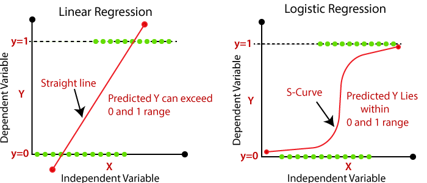

```{r setup, include=FALSE}
knitr::opts_chunk$set(echo = TRUE)
```

복습

- 저번 회차에서 다중공선성이 발생하는 이유, 발생했을 때의 문제, 다중공선성의 감지에 대해 다루었다.
- 이런 다중공선성이 발생했을 때는 모델을 상대적으로 간단하게 바꿔주는 방식이 필요하다.
- 다중공선성을 해결하는 방법으로 변수선택법, 정규화가 있다.
- 변수선택법은 Heuristic한 방법으로, 계산량이 많은 방법이지만 아이디어가 간단하다.
- 정규화는 각각의 베타계수가 커지는 것을 막음으로서 기존의 베타값보다 작은 값이 나오도록 한다.
- 릿지는 정확히 0으로 수렴하는 베타가 존재하지 않지만, 라쏘는 정확하게 0으로 수렴하는 베타가 존재한다.

이번주는 이제 회귀분석을 확장해서, Y가 범주형 변수일 때 진행하는 로지스틱 회귀분석에 대해 다루려고 한다. 먼저 확률을 비교하는 측도와, 회귀분석의 확장을 이해하고 로지스틱 회귀로 넘어가자. 그리고 다범주 로지스틱회귀분석, 포아송 회귀분석에 대해 정말 가볍게 다룬다. 분할표와 GLM의 많은 내용을 삭제하고 정말 슬쩍 보는 식으로 만들었으니 조금 일찍 끝날수도 있겠습니다!

# 확률의 비교 측도

로지스틱 모델에서 사용하는 오즈(Odds)를 이해하기 위해서는 확률을 비교하는 측도들에 대해 이해해야 한다. 비율의 차이, 상대위험도, 오즈비에 대해 알아보자.

## 분할표

분할표는 범주형 변수 결과의 도수들을 각 칸에 넣어 표로 정리한 것이다. 이런 분할표는 범주형 변수들에 대해서만 만들 수 있다. 2차원 분할표를 통해서, 각 범주에 속하는 비율을 계산하면 다음과 같다.

```{r, echo = FALSE, fig.cap = 'Contingency table', fig.align='center', out.width='60%'}

```

이 분할표를 통해 확률들을 비교하는 방법들에 대해 알아보자.

## 비율의 차이

```{r, echo = FALSE, fig.cap = '', fig.align='center', out.width='60%'}

```

조건부 확률의 차 : $\pi_1-\pi_2$

1) $\pi_1$ : 첫번째 행의 $Y$에 대한 조건부 확률

  - 저기서는 성별이 주어졌을 때, 연인 여부에 대한 확률
  
2) 범위 : $-1 \leq \pi_1 - \pi_2 \leq 1$

3) 독립 : $\pi_1-\pi_2=0$

4) 단점 : 0에 가까워질수록 차이가 큰 것을 반영하지 못함.

## 상대 위험도

```{r, echo = FALSE, fig.cap = 'Relative Risk', fig.align='center', out.width='60%'}

```

아까는 조건부 확률끼리의 차이를 계산했다면, 이번에는 비율을 계산하자. 위의 예시의 경우, 상대 위험도는 0.8144/0.7928=1.027. 즉 여성일 경우 연인이 있을 확률이 1.027배 높다고 해석할 수 있다.

조건부 확률의 비 : $\frac{\pi_1}{\pi_2}$

1) 범위 : $\frac{\pi_1}{\pi_2} \geq 0$

2) 독립 : $\frac{\pi_1}{\pi_2}=1$

3) 단점 : 확률이 0이나 1에 가까울 때, 영향력 차이가 많이 난다. 대칭적이지 않다고도 이해할 수 있다.

```{r, echo = FALSE, fig.cap = 'Relative Risk2', fig.align='center', out.width='80%'}

```

각각 모두 확률의 차이는 0.01로 매우 작지만, 왼쪽의 상대위험도는 2이고, 오른쪽의 상대위험도는 1.01로 큰 차이가 나타난다.

## 오즈비

오즈(odds, 승산)은 성공확룰/실패확률이다. 오즈라는 개념이 매우 생소할 수 밖에 없지만 예시를 통해 이해하자.

```{r, echo = FALSE, fig.cap = 'Odds Ratio', fig.align='center', out.width='60%'}

```

'실패에 비해 성공이 몇배인가'를 확인하는 것이 오즈다. 이 오즈는 앞으로 계속 사용될 예정이다.

오즈비 : $\theta = \frac{\pi_1/(1-\pi_1)}{\pi_2/(1-\pi_2)}$

1) 범위 : $\theta \geq 0$

2) 독립 : $\theta = 1$

3) 설명 

  - $\theta > 1$ : 첫번째 행에서의 성공의 오즈가 두번재 행보다 높다.
  - $0 \leq \theta < 1$ : 첫번째 행에서의 성공의 오즈가 두번재 행보다 낮다.

4) 장점 : 연구디자인 측면에서 X와 Y를 구분하지 않아도 계산 결과가 같다.

  - 오즈비는 그 자체로도 장점이 존재하지만, 로지스틱 회귀분석의 꼴을 유도하다보니 저절로 오즈비가 사용된 맥락도 존재한다. 따라서 그냥 오즈비가 다른 확률 비교의 측도보다 좋다고 외우는 편이 낫다.
  
## 로그 오즈비

오즈비 $\theta$는 0보다 크다. 따라서 만약 오즈비에 로그를 취해주게 되면, $-\infty < \log \theta < \infty$가 되게 되어서, 0에 대해 대칭이 된다. 또한 로그 오즈비는 근사적으로 정규분포를 따른다고 볼 수 있다. 왜냐하면 0에 대해 대칭이니까, 분산만 적당하게 맞춰주면 되기 때문!!

# Generalized Linear Model

## GLM이란?

GLM(일반화 선형모형)이란 기존의 회귀분석처럼 연속형 반응변수에 대한 모델 뿐만 아니라 범주형 반응변수, count 반응변수에 대한 모델을 모두 포함하는 일반화된 선형 모형이다. 원래는 우리는 관측가능한 연속형 반응변수 Y에 대해서 모델링은 진행했는데, 이를 조금 확장한다. 

이런 경우 오차항의 분포는 정규분포일 수 없다. 범주형 반응변수는 0 혹은 1의 값을 가지고, count형 반응변수는 결국 0보다 큰 경우에서 도수가 낮은 쪽에 몰려 있기 때문에 Y의 분포가 정규분포와 크게 어긋나는 형태이다. 따라서 이런 데이터들에 대해서는 정규분포를 가정한 회귀분석을 시행할 수 없다. 따라서 정규분포의 형태와 유사하게 만들어 주는 작업이 먼저 필요하게 된다. 정규분포의 형태와 유사하게 만들어주는 작업을 수행해 주는 함수를 연결함수(Link Function)이라고 한다. 이를 통해 이해해보자.

### 기존의 회귀분석

연결함수 $g(\mu)=\mu$ : 기존의 회귀분석은 y의 범위가 마이너스 무한대부터 무한대까지 가질 수 있기 때문에(실제로 그렇지 않은 경우가 있더라도 이론적으로는 그렇기 때문에) 다른 연결함수를 도입할 필요가 없다. 

### 로짓 연결함수

아까 오즈비를 보았지? 오즈의 로그값을 모형화 하는 것이 로짓 연결함수이다.

연결함수 $g(\mu)= \log \frac{\mu}{1-\mu}$ : 반응변수가 확률과 같이 0과 1사이에 있는 값일때 유용하다. 이것이 바로 로지스틱회귀분석에 사용되는 연결함수이다.

### 로그 연결함수

연결함수 $g(\mu)=\log \mu$ : 반응형 변수가 도수(Count) 자료인 경우 사용된다. 왜냐하면 0보다 큰 값이 로그를 취해주게 되면 마이너스 무한대부터 무한대까지의 값을 가질 수 있기 때문에! 이를 사용하는 회귀분석은 포아송 회귀분석이다.

```{r, echo = FALSE, fig.cap = 'Generalized Linear Model', fig.align='center', out.width='70%'}

```

다음과 같이 진짜 GLM의 종류가 많다. 우리는 이중에서 로지스틱 회귀모형/다항로짓/포아송 회귀모형을 간단하게 살펴보려 한다.

## 유의성 검정 in GLM

이전에 회귀분석에서는 유의성 검정을 전체 모델에 대해서는 F검정을 시행했고, 각각 변수들에 대해서는 t검정을 시행했다. GLM에서는 모두 카이제곱검정을 사용하는데, 여기서 기반이 되는 개념이 4회차에 간단히 다룬 LRT(가능도비 검정)이다. 가능도비 검정을 짰더니 자연스럽게 카이제곱 검정의 형태가 나왔다고 이해하면 된다.

### 전체 변수에 대한 유의성 검정

$$
H_0 : \beta_1=\cdots =\beta_k=0 \quad \quad vs \quad \quad H_1 : \text{at least one non-zero}
$$

검정 통계량 : $-2 \log (L_0/L_1)= -2 (l_0-l_1) \sim \chi_1^2$

  - 왜 자유도 1의 카이제곱분포를 따르는지는 이제 현재 난이도에서 다루는 것이 불가능하므로 넘어갑니다.
  
flow : 검정통계량 값이 작다 -> p-value가 작다 -> 귀무가설을 기각한다 -> 적어도 하나의 $\beta$는 0이 아니겠다. -> 우리의 모델은 의미가 있다.

### 관심있는 변수에 대한 유의성 검정

개별 변수에 대한 검정도 카이제곱 분포를 따르도록 검정하는 것이 가능하다. 이는 다양하게 짜게 될 수 있는데 예시는 다음과 같이 들 수 있다.

$$
\\
\\
\\
\\
\\
$$

R에서는 각각 개별 변수에 대한 유의성 검정을 summary를 통해 쉽게 확인할 수 있는데, 이때는 z검정을 한다. 아마도 자유도 1의 카이제곱 분포가 표준 정규분포와 연관성이 크기 때문인 것으로 보인다.

```{r, echo = FALSE, fig.cap = 'R summary', fig.align='center', out.width='80%'}

```

이런 유의성 검정의 플로우는 앞으로 다룰 로지스틱, 다중로지스틱, 포아송 회귀분석에서도 동일하게 적용 가능하다고 이해하면 된다.

# GLM의 예시

## 로지스틱 회귀분석

### 범위 맞춰주기

로지스틱 회귀분석을 반응변수 Y가 이항(binary) 변수일 때 사용한다. 결국 $Y \sim Ber(\pi)$를 따른다고 가정하고 문제를 다루게 된다. 근데 만약에 그냥 회귀분석의 형태로 $\pi(x)=\beta_0+\beta_1x$로 식을 적합하면 어떤 문제가 발생할까?

```{r, echo = FALSE, fig.cap = 'Necessity of Logit', fig.align='center', out.width='80%'}

```

범위가 일치하지 않게 된다. 그냥 선형회귀분석은 마이너스 무한대부터 무한대까지 값을 가질 수 있는데, 확률값은 0부터 1까지의 값밖에 못가지니! 그래서 우리는 로짓을 링크로 이용해서 범위를 맞춰주려 한다.

$$
\log (\frac{\pi_i}{1-\pi_i})= \beta_0 + \beta_1 x_{i1} + \cdots + \beta_px_{ip}  \quad\quad \Rightarrow \quad \quad 
\pi_i=\frac{\exp(\beta_0 + \beta_1 x_{i1} + \cdots + \beta_px_{ip})}{1+ \exp(\beta_0 + \beta_1 x_{i1} + \cdots + \beta_px_{ip})}
$$


$$
\begin{aligned}
&0 \leq \pi_i \leq 1, \quad \quad 0 \leq 1-\pi_i \leq 1 \\
&0 \leq \frac{\pi_i}{1-\pi_i} \leq \infty \\
&-\infty < \log (\frac{\pi_i}{1-\pi_i}) < \infty
\end{aligned}
$$

이런 Y에 대한 변환이 가해지게 되고, 여기서 어떤 오차에 대한 가정도 하지 않았기 때문에 가정(등분산성, 정규성)으로부터 자유로운 모델이다. 물론 독립성은 지켜주는 것이 좋다. 시간의 흐름이나 공간적 특성을 가지고 관측된 데이터들에 대해서는 여전히 한계가 존재한다.

그래서 피팅되서 나온 값에 대해 0인지 1인지 어떻게 부여할 수 있는가? 우측의 선형결합 부분이 마이너스 무한대부터 무한대까지 값을 가질 수 있는데, 마이너스 값을 가지면 확률값 $\pi_i$가 0.5보다 작다고 할 수 있다. 보통 0.5를 기준으로 0과 1을 선택하는 기준을 만들지만, 이는 언제든지 변형될 수 있다. 하지만 통상적으로는 0.5가 기준이다.

$$
\\
\\
\\
$$

```{r, echo = FALSE, fig.cap = 'Cut-off', fig.align='center', out.width='70%'}

```

### 해석

개별 베타에 대한 해석을 어떻게 할 수 있을까? 기존 회귀분석보다 해석이 쉽지는 않다. 기존 회귀분석은 '다른 변수를 고정한 상태에서 x가 한 단위 증가할 때 y가 증가하는 양'이라고 해석했었다. 하지만 로지스틱 회귀분석은 직선을 사용하지 않고, 로짓링크를 이용하기 때문에 그렇게 해석하는 데에는 한계가 있다. 

먼저 대충/가볍게 하는, 하지만 이해하기 쉬운 해석을 하자. $\beta >0$인 경우, 해당 x가 커질수록 전체 함수값이 커지므로 1에 기여하는 변수라고 별 수 있고, $\beta < 0$인 경우에는 해당 x가 커질수록 전체 함수값이 작아지므로 0에 기여하는 변수라고 할 수 있다. 또한 베타의 절대값이 크면 클수록, 모델에서 가장 영향력이 강한 변수라고 해석할 수 있다.

아까 배운 오즈비로 해석을 해볼 수 있다. x가 한 단위 증가함에 따라 오즈는 $e^{\beta}$만큼 증가한다고 말할 수 있다. 하지만 오즈라는 개념이 직관적이지 않기 때문에, 그냥 편하게(부정확하지만 직관적인) 해석하기 위해서 '성공할 가능성이 $e^{\beta}$ 배만큼 증가한다'고 말하기도 한다. 특정 조건에서는 이게 맞는 표현이 되기도 하지만, 그냥 기본에 충실하게 해석하는 것이 좋고, 이를 설명하기 어려울때는 위의 방법처럼 베타의 부호와 절대값에 기반해서 해석하자.

## 다중 로지스틱 회귀분석

이번에는 Y가 두개의 값이 아닌 여러 $K$개의 값을 가질 수 있다고 하자. 이런 경우에는 Y의 분포를 다항분포로 연결시킬 수 있다. 자세한 내용은 생략하고, 수식을 통해보자. 여기부터는 그냥 더욱 더 대충/심각하지 않게 보면 된다.

$$
\log \frac{P(Y=k|X=x)}{P(Y=K|X=x)} = \beta_{0k} + \beta_{1k} x_{1} + \cdots + \beta_{pk}x_{p}, \quad\quad 
\sum_{k=1}^KP(Y=k|X=x)=1
$$

각 범주 k에 속할 확률값에 일종에 로짓변환을 하되, 각각 k개의 범주에 대해 $k-1$개의 회귀식을 적합하는 형태다. 마지막 범주 $K$는 여기서 언제나 바닥으로 깔리는 범주가 되게 된다. 이를 Baseline category라고 하고, R에서는 그냥 알파벳이 앞에 있을수록 베이스라인 카테고리로 자동 지정된다. 각 범주에 속할 확률값을 구하면 다음과 같다.

$$
P(Y=k|X=x)=\frac{\exp(\beta_{0k} + \beta_{1k} x_{1} + \cdots + \beta_{pk}x_{p})}{1+\sum_{j=1}^{K-1} \exp(\beta_{0k} + \beta_{1k} x_{1} + \cdots + \beta_{pk}x_{p})}
$$

$$
P(Y=K|X=x)=\frac{1}{1+\sum_{j=1}^{K-1} \exp(\beta_{0k} + \beta_{1k} x_{1} + \cdots + \beta_{pk}x_{p})}
$$

## 포아송 회귀분석

포아송 회귀분석은 반응변수 Y가 count data일 때 사용한다. 물론 만약에 우리의 데이터에서 발생 횟수가 충분히 많다고 하면, 예를 들어 일일 따릉이 대여 횟수에 대해서 분석할 때 일일 따릉이 대여 건수의 분포가 평균이 100이 되고 정규분포 형태처럼 분포한다고 하면 문제가 없다. 하지만 이런 포아송 회귀분석이 유용한 이유는, 이렇게 정규분포로 근사하기에는 어려운, 보통 발생건수가 {0, 1, 2, 3}과 같이 조금 발생하는 사건들이 대부분일 때이다. 다시 말하지만, 발생횟수가 충분하면 그냥 기존 회귀분석을 사용해도 아무런 문제가 없다! 하지만 그렇지 않다면 우리는 Y에 대한 포아송 분포를 가정하는 회귀분석을 시행하는 것이 더 적절하다.

### 범위 맞춰주기

그런데 포아송 회귀분석도 범위를 맞춰주어야 한다. 결국에 우리가 관찰 가능한 값은 0부터 무한대까지 값만 가질 수 있다. 따라서 이를 해결해주기 위해 로그를 씌워준다.

$$
\begin{aligned}
Y &\sim pois(\mu) \\
\log (\mu) = \beta_0 + &\beta_1x_1 + \cdots + \beta_px_p
\end{aligned}
$$

### 해석

$$
\mu = \exp (\beta_0 + \beta_1x_1 + \cdots + \beta_p x_p)
$$

베타에 대한 해석은 'x가 한단위 증가할 때 발생의 기대도수가 $e^{\beta}$만큼 증가한다'고 해석하면 된다. 귀찮으면 베타의 절대값과 부호를 중심으로 설명하자. 그것만으로도 충분하다.

# GLM에 대한 다중공선성

GLM 모델도 다중공선성과 관련한 문제가 없지는 않다. 하지만 기존의 회귀모형처럼 절대적이지는 않다. 그렇다고 하더라도, 모델의 성능을 높이기 위해서는 변수선택이나 정규화가 필요하다. GLM에 대해서도 모두 7회차에서 다룬 방법들을 적용 가능하니 걱정하지 말자!
